## **Experiment - 1**: Comparison of Virtual Machines (VMs) and Containers using Ubuntu and Nginx

### **Objective**
1. To understand the conceptual and practical differences between Virtual Machines and Containers.

2. To install and configure a Virtual Machine using VirtualBox and Vagrant on Windows.

3. To install and configure Containers using Docker inside WSL.

4. To deploy an Ubuntu-based Nginx web server in both environments.

5. To compare resource utilization, performance, and operational characteristics of VMs and Containers.


### **Part A: Virtual Machine (VMs)**
 - Ensuring the installation via `vagrant -v`
 - Firstly download the Vagrantfile of required VM OS using `vagrant init hashicorp/bionic64` 
 - Run `vagrant up` to start up the VM and `vagrant ssh` to access the VM terminal.

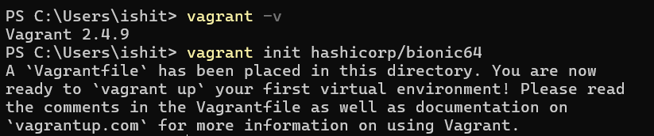
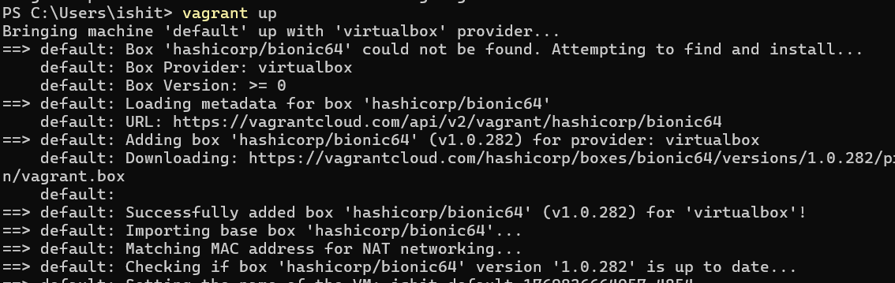
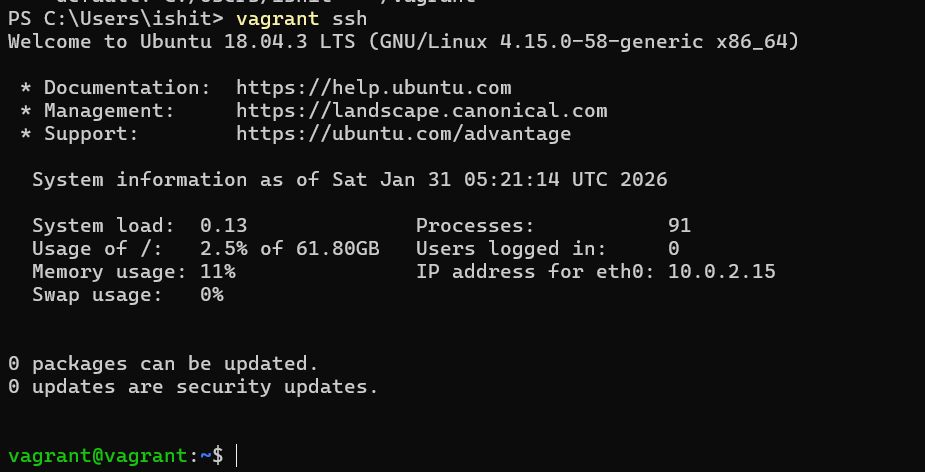

 - Now installing nginx using `sudo apt install -y nginx` and running the service using `sudo systemctl start nginx`.
 - Verifying it by `curl localhost`.

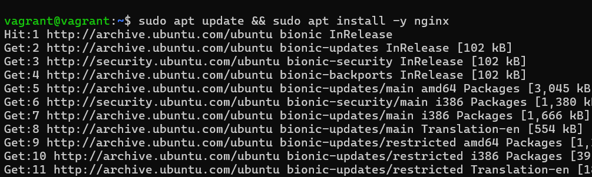
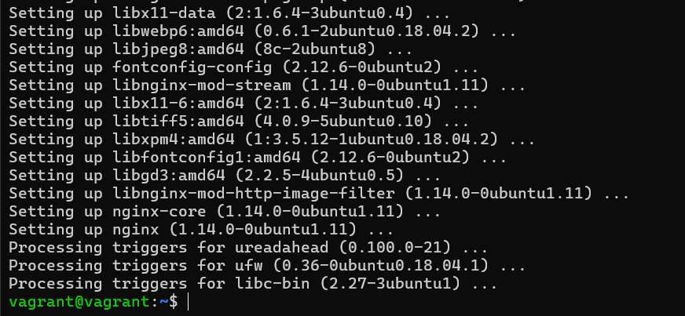
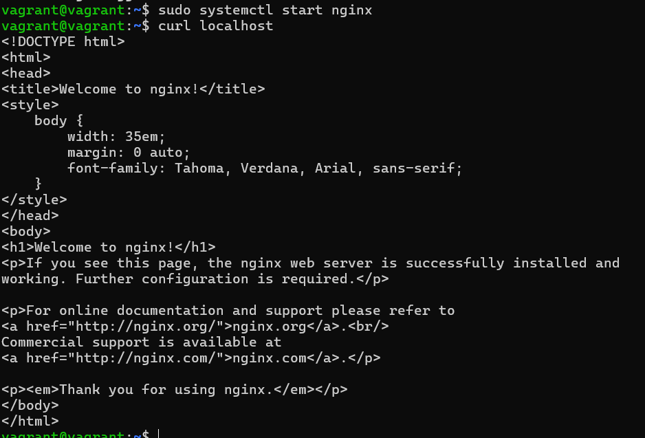

#### **Observations**
**1. Storage Utilization:** The disk usage for the VM.
```PS
VBoxManage showmediuminfo <path/to/virtualdrive>
```
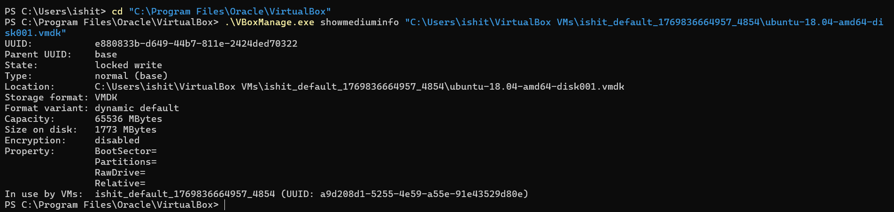
  
> The VM installation consumed approximately **1773 MB** of disk space to store the Guest OS and virtual disk.

**2. Boot Performance:** The startup time required for the Virtual Machine to boot.
```bash
systemd-analyze
```
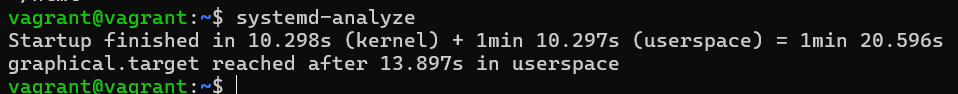
> The VM took **1 min 20.596 seconds** to fully boot (Kernel: 10.298s + Userspace: 1min 10.297s), which basically depicts high startup latency.

**3. Memory Usage:** Amount of RAM resources allocated to and used by the Guest OS.

```bash
free -h
```


> The VM reserved **985 MB** of total RAM from the host, with *72 MB* actively used and 666 MB used up in buffers/cache.

### **Part B: Containers**

 - Run the `docker run -d -p 8080:80 --name nginx-container nginx` command to create and run the container. Verify that the nginx container is running wih `curl localhost:8080`.

    - `-d`: Runs the container in the background, allowing you to continue using the terminal session.
    - `-p 8080:80`: Maps port 8080 for the host to port 80 for the container.

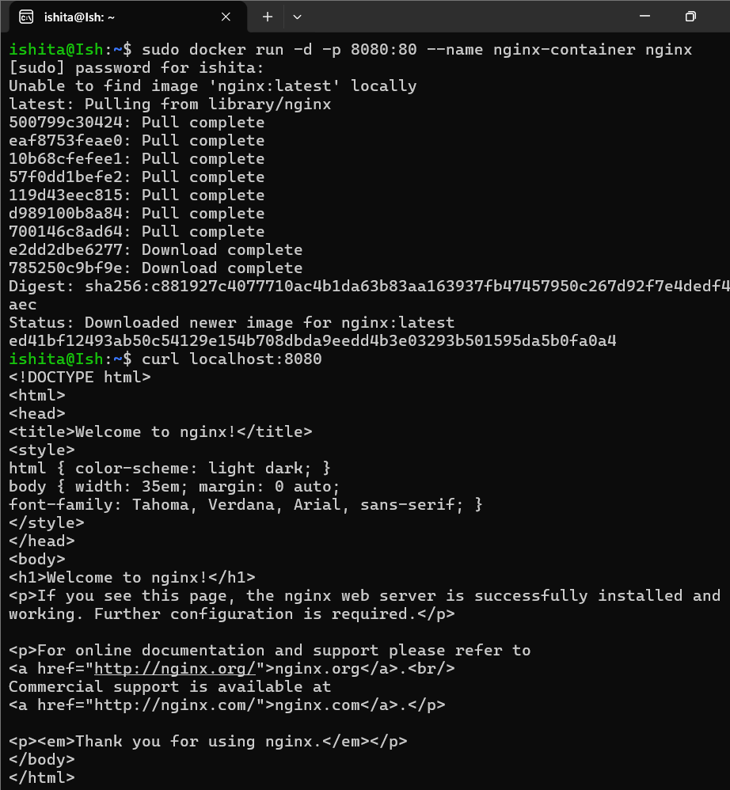


#### **Observations**
**1. Storage Utilization**
An analysis of the disk space required for the container images.

```bash
docker images
```

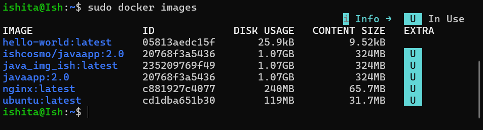

> The Nginx container image requires only **240 MB**.

**2. Boot Performance**
Measurement of the time required to start the containerized application.

```bash
time docker run -d -p 8080:80 --name nginx-container nginx
```
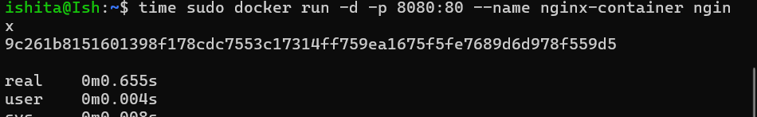

> The container started in **0.08 seconds**.

**3. Memory Allocation**
Real-time monitoring of the container's resource consumption.

```bash
docker stats
```
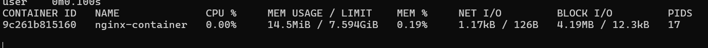

> The running container uses **14.5 MiB** of RAM.

### **Comparison**

| Metric | Virtual Machine | Container | Difference |
| :--- | :--- | :--- | :--- |
| **Disk Usage** | **~1.8 GB** | **240 MB** | Containers are *smaller* because they do not require a full Guest OS copy. |
| **Boot Time** | **1.20 min** | **0.08s**  | Containers start *faster* because of the already-running Host Kernel. |
| **Memory** | **~985 MB** Reserved / *72 MB* Used | **14.5 MB** Used | VMs reserve a fix block of RAM; Containers use only whats needed (dynamic) |
| **Architecture** | **Hardware Virtualization** (Guest OS) | **OS Virtualization** (Shared Kernel) | VMs run a full isolated OS ; Containers run as isolated processes on the Host OS. |