## Experiment 10: Working with SonarQube
<hr>

<h4 align="center"> Introduction </h4>

<hr>

#### **What is SonarQube?**
SonarQube is an open-source platform for continuous inspection of code quality. It performs automatic reviews with static analysis to detect bugs, code smells & security vulnerabilities.

#### **How SonarQube Solves the Problem:**

- **Continuous Inspection**: Scans code with every commit, providing immediate feedback.
- **Quality Gates:** Defines pass/fail criteria for code quality.
- **Technical Debt Quantification:** Measures effort needed to fix issues.
- **Multi-language Support:** Supports 20+ programming languages.
- **Visual Analytics:** Dashboard showing code quality metrics and trends.

#### **Key Terms:**

| Term | What it means |
|------|--------------|
| Quality Gate | A set of rules; code must pass before deployment |
| Bug | Code that will likely break or behave incorrectly |
| Vulnerability | A security weakness in the code |
| Code Smell | Code that works but is poorly written or hard to maintain |
| Technical Debt | Estimated time to fix all issues |
| Coverage | Percentage of code tested by unit tests |
| Duplication | Repeated code blocks (copy-paste) |

<hr>

<h4 align="center"> Practical </h4>

<hr>

**Step-1:- Create a `docker-compose.yml`**


```yml
version: '3.8'

services:
  sonar-db:
    image: postgres:13
    container_name: sonar-db
    environment:
      POSTGRES_USER: sonar
      POSTGRES_PASSWORD: sonar
      POSTGRES_DB: sonarqube
    volumes:
      - sonar-db-data:/var/lib/postgresql/data
    networks:
      - sonarqube-lab

  sonarqube:
    image: sonarqube:lts-community
    container_name: sonarqube
    ports:
      - "9000:9000"
    environment:
      SONAR_JDBC_URL: jdbc:postgresql://sonar-db:5432/sonarqube
      SONAR_JDBC_USERNAME: sonar
      SONAR_JDBC_PASSWORD: sonar
    volumes:
      - sonar-data:/opt/sonarqube/data
      - sonar-extensions:/opt/sonarqube/extensions
    depends_on:
      - sonar-db
    networks:
      - sonarqube-lab

volumes:
  sonar-db-data:
  sonar-data:
  sonar-extensions:

networks:
  sonarqube-lab:
    driver: bridge
```


**Step-2:- Start Compose**
```bash
docker-compose up -d
```
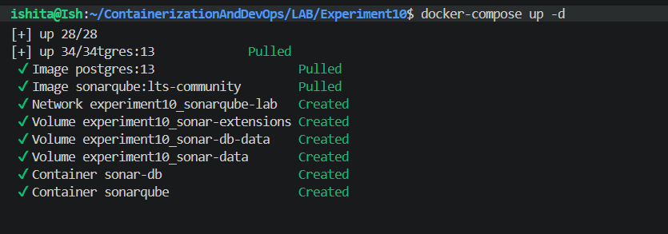


**Step-3:- Verify SonarQube is running via Logs**
```bash
docker-compose logs -f sonarqube
```
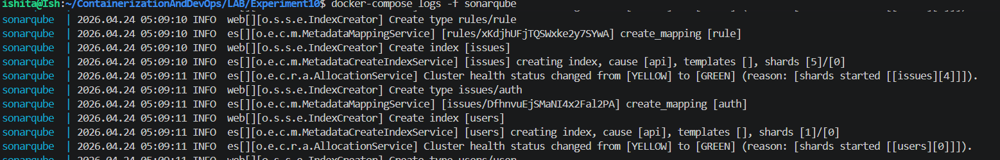


**Step-4:- Login to SonarQube**
```
http://localhost:9000
```
- username: `admin`
- password: `admin`

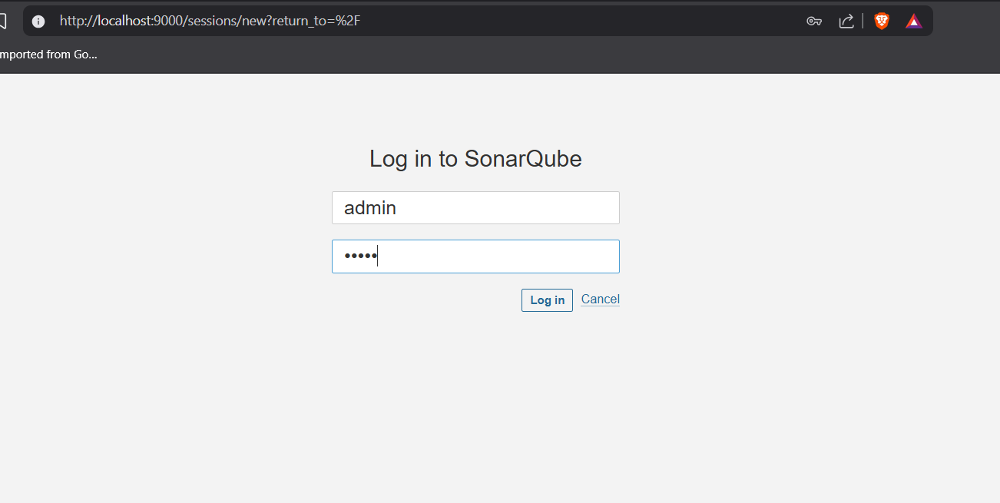


**Step-5:- HomePage**

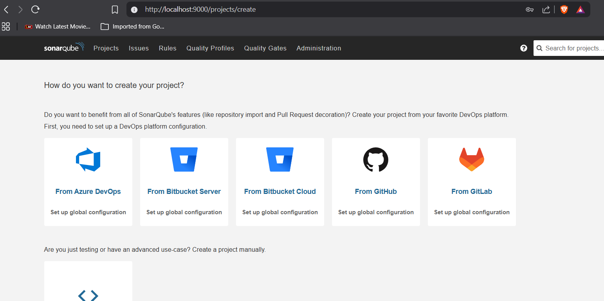


**Step-6:- Create Sample Java App**
```bash
mkdir -p sample-java-app/src/main/java/com/example
cd sample-java-app
```
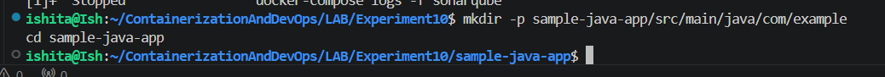


**Step-7:- Create `Calculator.java`**
```bash
nano src/main/java/com/example/Calculator.java
```
```java
package com.example;

public class Calculator {

    // BUG: Division by zero is not handled
    public int divide(int a, int b) {
        return a / b;
    }

    // CODE SMELL: Unused variable
    public int add(int a, int b) {
        int result = a + b;
        int unused = 100;
        return result;
    }

    // VULNERABILITY: SQL Injection risk
    public String getUser(String userId) {
        String query = "SELECT * FROM users WHERE id = " + userId;
        return query;
    }

    // CODE SMELL: Duplicated code
    public int multiply(int a, int b) {
        int result = 0;
        for (int i = 0; i < b; i++) {
            result = result + a;
        }
        return result;
    }

    public int multiplyAlt(int a, int b) {
        int result = 0;
        for (int i = 0; i < b; i++) {
            result = result + a;
        }
        return result;
    }

    // BUG: Null pointer risk
    public String getName(String name) {
        return name.toUpperCase();
    }

    // CODE SMELL: Empty catch block
    public void riskyOperation() {
        try {
            int x = 10 / 0;
        } catch (Exception e) {
        }
    }
}
```
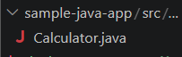


**Step-8:- Create `pom.xml`**
```bash
nano pom.xml
```
```xml
<?xml version="1.0" encoding="UTF-8"?>
<project xmlns="http://maven.apache.org/POM/4.0.0"
         xmlns:xsi="http://www.w3.org/2001/XMLSchema-instance"
         xsi:schemaLocation="http://maven.apache.org/POM/4.0.0
         http://maven.apache.org/xsd/maven-4.0.0.xsd">

    <modelVersion>4.0.0</modelVersion>

    <groupId>com.example</groupId>
    <artifactId>sample-app</artifactId>
    <version>1.0-SNAPSHOT</version>

    <properties>
        <maven.compiler.source>11</maven.compiler.source>
        <maven.compiler.target>11</maven.compiler.target>

        <!-- SonarQube connection settings -->
        <sonar.projectKey>sample-java-app</sonar.projectKey>
        <sonar.host.url>http://localhost:9000</sonar.host.url>
        <!-- Replace with your actual token (generated in Step 9) -->
        <sonar.login>YOUR_TOKEN_HERE</sonar.login>
    </properties>

    <dependencies>
        <!-- JUnit for unit tests -->
        <dependency>
            <groupId>junit</groupId>
            <artifactId>junit</artifactId>
            <version>4.13.2</version>
            <scope>test</scope>
        </dependency>
    </dependencies>

    <build>
        <plugins>
            <!-- This plugin lets us run: mvn sonar:sonar -->
            <plugin>
                <groupId>org.sonarsource.scanner.maven</groupId>
                <artifactId>sonar-maven-plugin</artifactId>
                <version>3.9.1.2184</version>
            </plugin>
        </plugins>
    </build>

</project>
```
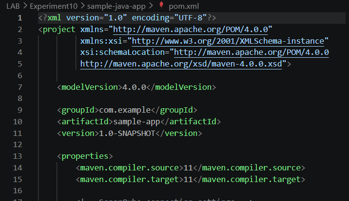


**Step-9:- Generate Token**

Navigate to: **Profile → My Account → Security**
- Token Name: `scanner-token`
- Click **Generate**
- Copy the token immediately — it is shown only once!

> **Important:** Store the token somewhere safe. You cannot retrieve it again after closing the page.

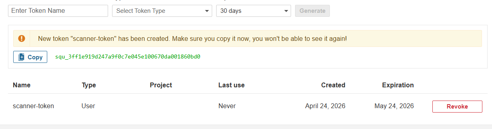


**Step-10:- Run Scanner**


```bash
mvn sonar:sonar -Dsonar.login=TOKEN
```
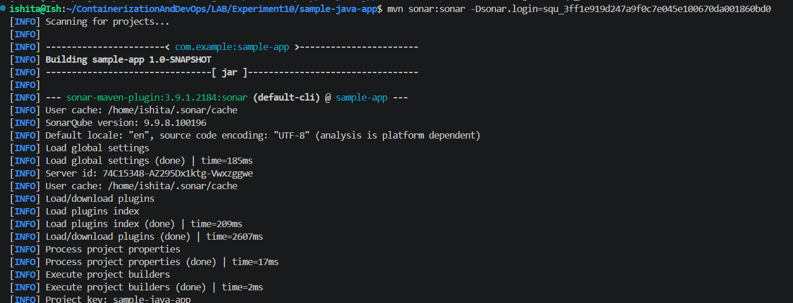


**Step-11:- Scroll down to verify Build Success**

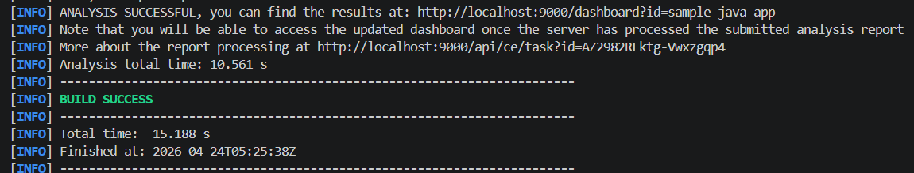


**Step-12:- View Analysis Results on Browser**

Open the dashboard:
```
http://localhost:9000/dashboard?id=sample-java-app
```
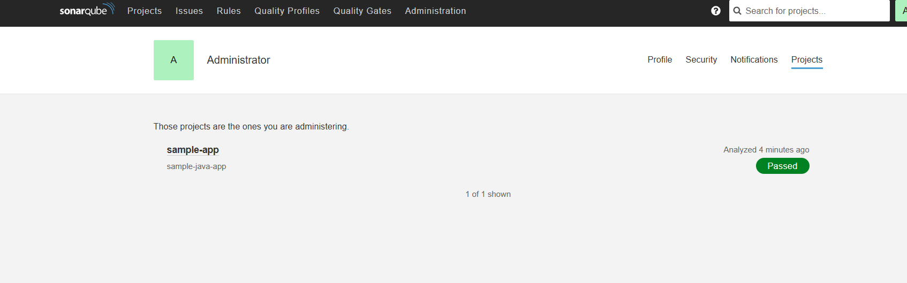


**Step-13:- View Detailed Report**

Click on any issue number to see the exact line and reason for each issue.

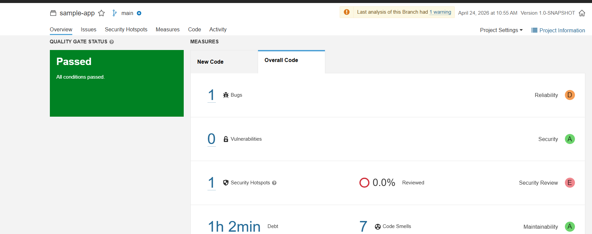


