## Experiment 11: Container Orchestration via Docker Swarm


#### **What is Docker Swarm?**
Docker Swarm is Docker's built-in container orchestration tool. It lets us manage a group of Docker hosts as a single cluster, automatically distributing containers across machines, scaling them up or down, and recovering from failures — all with commands you already know from Docker.

#### **The Progression Path**

```
docker run  →  Docker Compose  →  Docker Swarm  →  Kubernetes
     │               │                  │                │
  Single          Multi-container    Multi-host       Advanced
  container       (single host)      Orchestration    Orchestration
```

> **This experiment focuses on:** Moving from Compose → Swarm

#### **Key Concepts:**

| Term | What it means |
|------|---------------|
| **Swarm** | A cluster of Docker hosts (nodes) managed together |
| **Manager Node** | The node that controls the swarm and schedules tasks |
| **Worker Node** | The node that runs the actual containers |
| **Service** | The Swarm equivalent of a Compose service — defines how many replicas to run |
| **Stack** | A group of services deployed together from a Compose file |
| **Replica** | A single running copy of a container in a service |
| **Self-healing** | Swarm automatically recreates containers if they crash |

#### **Docker Compose vs Docker Swarm:**

| Aspect | Docker Compose | Docker Swarm |
|--------|---------------|--------------|
| Hosts | Single machine only | Multiple machines (cluster) |
| Scaling | Manual (`--scale`) | Built-in (`service scale`) |
| Self-healing | No | Yes — auto-restarts failed containers |
| Load balancing | No | Yes — built-in across replicas |
| Use case | Development | Production / multi-host |


**Step-1:- Create a `docker-compose.yml`**


```yml
version: '3.9'

services:
  db:
    image: mysql:5.7
    restart: always
    environment:
      MYSQL_ROOT_PASSWORD: rootpass
      MYSQL_DATABASE: wordpress
      MYSQL_USER: wpuser
      MYSQL_PASSWORD: wppass
    volumes:
      - db_data:/var/lib/mysql

  wordpress:
    image: wordpress:latest
    depends_on:
      - db
    ports:
      - "8080:80"
    restart: always
    environment:
      WORDPRESS_DB_HOST: db:3306
      WORDPRESS_DB_USER: wpuser
      WORDPRESS_DB_PASSWORD: wppass
      WORDPRESS_DB_NAME: wordpress
    volumes:
      - wp_data:/var/www/html

volumes:
  db_data:
  wp_data:
```
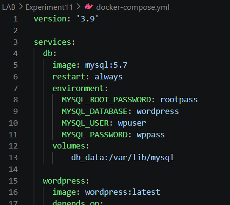


**Step-2:- Initialize Swarm**

This turns the current machine into a Swarm **manager node**:
```bash
docker swarm init
```


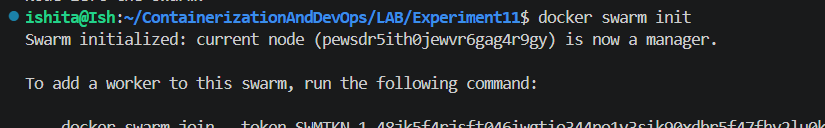


**Step-3:- Verify Swarm is Active**
```bash
docker node ls
```
>I saw my machine listed with role `Leader` and status `Ready`.

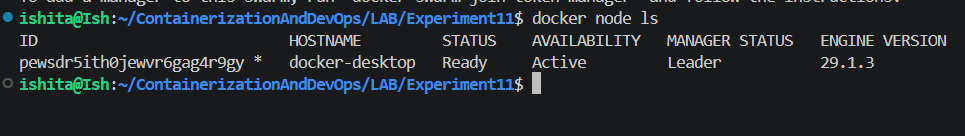


**Step-4:- Deploy the Stack**

A **stack** is how we deploy a Compose file onto a Swarm. The name `wpstack` is the stack name:
```bash
docker stack deploy -c docker-compose.yml wpstack
```
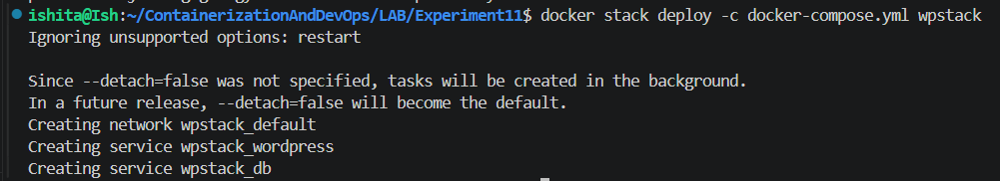


**Step-5:- Verify Running Services**
```bash
docker service ls
```


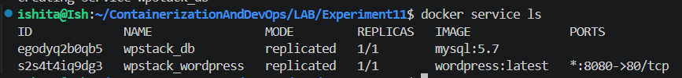


**Step-6:- Inspect the WordPress Service Tasks**
```bash
docker service ps wpstack_wordpress
```
> This shows which node each replica is running on and its current state.


**Step-7:- List Running Containers**
```bash
docker ps
```
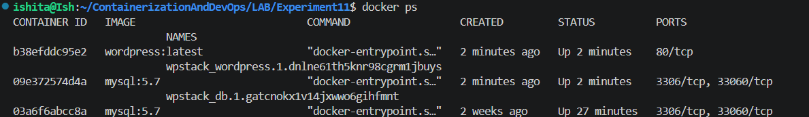


**Step-8:- Access the Application in Browser**
```
http://localhost:8081/
```
> WordPress is now  accessible..


**Step-9:- Scale the WordPress Service**

Increase the number of WordPress replicas from 1 to 3:
```bash
docker service scale wpstack_wordpress=3
```
> Swarm automatically starts 2 new containers to reach the desired count of 3.

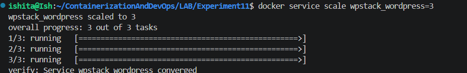


**Step-10:- Verify the Scaling**
```bash
docker service ls
```
> The `REPLICAS` column for `wpstack_wordpress` now shows `3/3`.

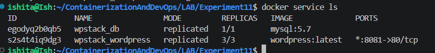


**Step-11:- List WordPress Containers**
```bash
docker ps | grep wordpress
```
> You should see 3 wordpress containers running.

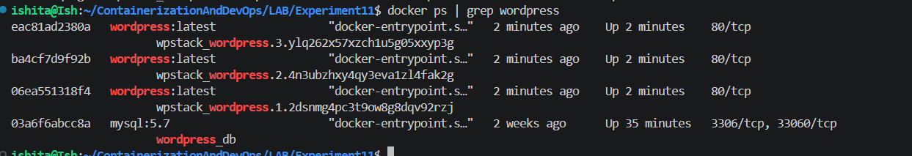


**Step-12:- Kill a Container to Trigger Self-Healing**

Copy any container ID from the list above and kill it:
```bash
docker kill <container-id>
```


**Step-13:- Watch Swarm Recreate the Container**

Swarm detects the missing replica and immediately starts a replacement:
```bash
docker service ps wpstack_wordpress
```
> Here i Saw the killed container listed as `Shutdown` and a new one as `Running`.ill

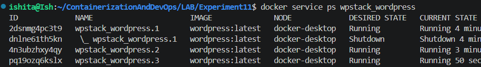


**Step-14:- Confirm the Container is Replaced**
```bash
docker ps | grep wordpress
```
> You should again see **3 running** WordPress containers — the swarm restored the desired state automatically.


**Step-15:- Remove the Stack**

```bash
docker stack rm wpstack
```
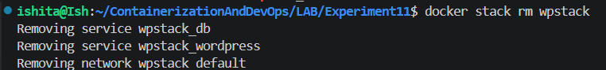


**Step-16:- Confirm Clean Removal**
```bash
docker service ls
docker ps
```


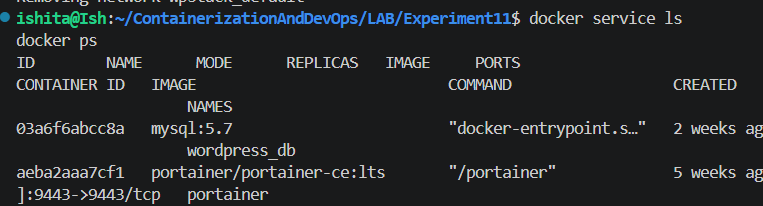

<hr>

<h4 align="center"> Conclusion </h4>

<hr>


| Started with | Now |
|--------------|------------|
| Single container (`docker run`) | Multi-container stack (Compose + Swarm) |
| Manual startup | One-command deployment (`stack deploy`) |
| Manual scaling | Instant scaling (`service scale`) |
| No fault tolerance | Automatic self-healing |
| Single host | Multi-host cluster ready |

#### **Quick Reference Card**

```bash
# Initialize Swarm (makes current machine the manager)
docker swarm init

# Deploy a stack from a Compose file
docker stack deploy -c docker-compose.yml <stack-name>

# List all services in the swarm
docker service ls

# See tasks (containers) for a specific service
docker service ps <service-name>

# Scale a service to N replicas
docker service scale <stack-name_service-name>=<N>

# Remove an entire stack
docker stack rm <stack-name>

# Leave the swarm (cleanup)
docker swarm leave --force
```

> **Key Takeaway:** Compose *defines* the application. Swarm *runs it reliably* — with scaling, load balancing, and automatic recovery built in.

