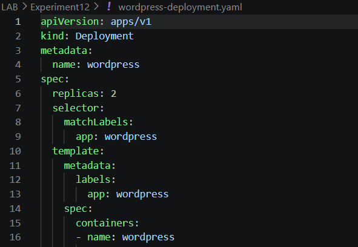
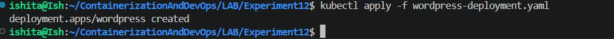
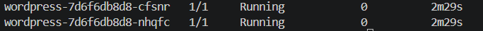
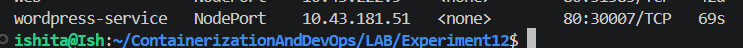
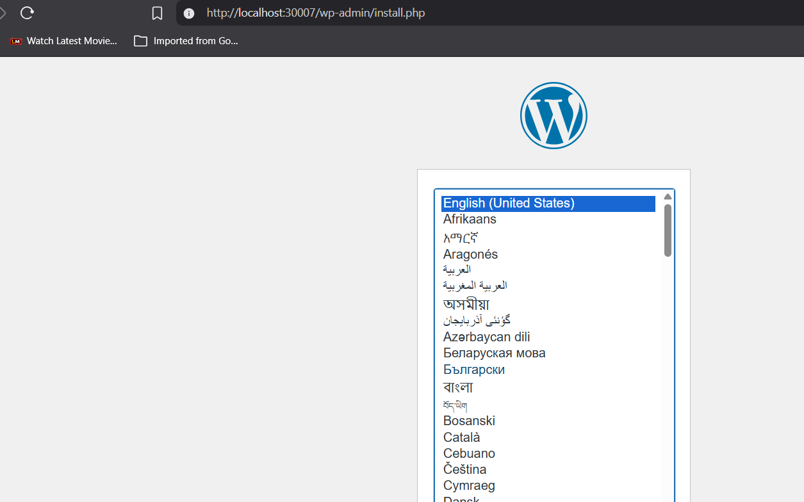
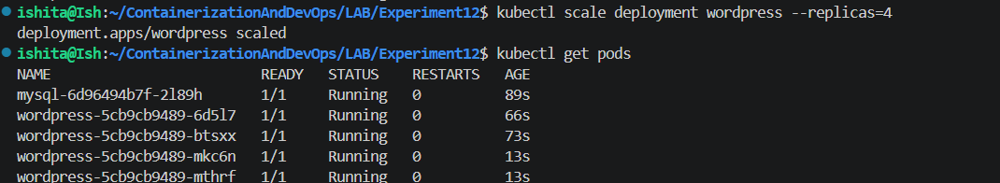
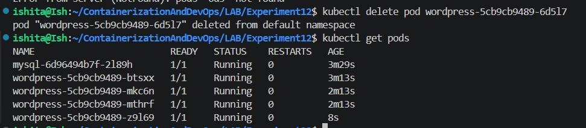
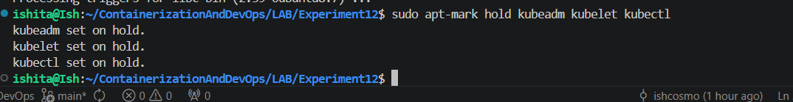

## Experiment 12: Study and Analyse Container Orchestration using Kubernetes


#### **What is Kubernetes?**
Kubernetes (K8s) is an open-source container orchestration platform that automates deployment, scaling, and management of containerized applications. It ensures your app keeps running, scales automatically, and recovers from failures — without manual intervention.

#### **Why Kubernetes over Docker Swarm?**

| Reason | Explanation |
|--------|-------------|
| Industry standard | Most companies use Kubernetes |
| Powerful scheduling | Automatically decides where to run your app |
| Large ecosystem | Many tools and plugins available |
| Cloud-native support | Works on AWS, Google Cloud, Azure, etc. |

#### **Core Kubernetes Concepts:**

| Docker Concept | Kubernetes Equivalent | What it means |
|---------------|----------------------|---------------|
| Container | **Pod** | A group of one or more containers. Smallest unit in K8s. |
| Compose service | **Deployment** | Describes how your app should run (e.g., 2 copies, which image to use) |
| Load balancing | **Service** | Exposes your app to the outside world or other pods |
| Scaling | **ReplicaSet** | Ensures a certain number of pod copies are always running |

#### **Tool Selection Guide:**

| Tool | Best for |
|------|----------|
| **k3d** | Quick learning on your laptop |
| **Minikube** | Single-node cluster testing |
| **kubeadm** | Real, production-style cluster |


---

### Part A — Basic Deployment & Service (k3d)

---

**Step-1:- Create `wordpress-deployment.yaml`**
```bash
nano wordpress-deployment.yaml
```
Paste This:
```yaml
# wordpress-deployment.yaml
apiVersion: apps/v1          # Which Kubernetes API to use
kind: Deployment             # Type of resource
metadata:
  name: wordpress            # Name of this deployment
spec:
  replicas: 2                # Run 2 identical pods
  selector:
    matchLabels:
      app: wordpress         # Pods with this label belong to this deployment
  template:
    metadata:
      labels:
        app: wordpress       # Label applied to each pod
    spec:
      containers:
      - name: wordpress
        image: wordpress:latest   # Docker image
        ports:
        - containerPort: 80       # Port inside the container
```



**Step-2:- Apply the Deployment**
```bash
kubectl apply -f wordpress-deployment.yaml
```
> **What happens?** Kubernetes creates 2 pods running WordPress.




**Step-3:- Create `wordpress-service.yaml`**

Pods are **temporary** (they can be deleted or recreated). A **Service** gives them a fixed IP and exposes them to the outside.
```bash
nano wordpress-service.yaml
```
Paste This:
```yaml
# wordpress-service.yaml
apiVersion: v1
kind: Service
metadata:
  name: wordpress-service
spec:
  type: NodePort                  # Exposes service on a port of each node (VM)
  selector:
    app: wordpress                # Send traffic to pods with this label
  ports:
    - port: 80                    # Service port
      targetPort: 80              # Pod port
      nodePort: 30007             # External port (range: 30000-32767)
```


**Step-4:- Apply the Service**
```bash
kubectl apply -f wordpress-service.yaml
```


**Step-5:- Verify Pods are Running**
```bash
kubectl get pods
```
Expected output:
```
NAME                         READY   STATUS    RESTARTS   AGE
wordpress-xxxxx-yyyyy        1/1     Running   0          1m
wordpress-xxxxx-zzzzz        1/1     Running   0          1m
```



**Step-6:- Verify the Service**
```bash
kubectl get svc
```
Expected output:
```
NAME                TYPE       CLUSTER-IP    PORT(S)        AGE
wordpress-service   NodePort   10.43.x.x     80:30007/TCP   1m
```



**Step-7:- Access WordPress in Browser**
```
http://<node-ip>:30007
```
- **Minikube:** run `minikube ip` to get the node IP
- **k3d:** use `localhost`




**Step-8:- Scale the Deployment**

Increase the number of pods from 2 to 4:
```bash
kubectl scale deployment wordpress --replicas=4
```
Verify:
```bash
kubectl get pods
```
> You should now see **4 running pods**.
> **Why scale?** More traffic → more copies → better performance.




**Step-9:- Self-Healing Demonstration**

Kubernetes automatically replaces failed pods. Delete one pod manually to observe:
```bash
# First, get pod names
kubectl get pods

# Delete one (replace <pod-name> with an actual name from above)
kubectl delete pod <pod-name>
```
Now check pods again:
```bash
kubectl get pods
```
> You will still see **4 pods** — the deleted one was **automatically recreated**.
>
> **Why?** The deployment ensures the desired number (4) is always running.



---

### Part B — Docker Swarm vs Kubernetes Comparison

---

| Feature | Docker Swarm | Kubernetes |
|---------|-------------|------------|
| Setup | Very easy | More complex |
| Scaling | Basic | Advanced (auto-scaling) |
| Ecosystem | Small | Huge (monitoring, logging) |
| Industry use | Rare | Standard |

> **Verdict:** Learn Kubernetes — it's what companies use.

---

### Part C — Advanced Lab: Real Cluster with kubeadm

---

> **Requirements:** 2 or 3 VMs (VirtualBox/VMware), Ubuntu 22.04 or 24.04, each with 2+ CPU & 2+ GB RAM.

**Step-10:- Install kubeadm, kubelet, kubectl on ALL nodes**
```bash
# Update system
sudo apt update

# Install required packages
sudo apt install -y apt-transport-https ca-certificates curl

# Add Kubernetes signing key
curl -fsSL https://pkgs.k8s.io/core:/stable:/v1.29/deb/Release.key | sudo gpg --dearmor -o /etc/apt/keyrings/kubernetes-apt-keyring.gpg

# Add Kubernetes repository
echo 'deb [signed-by=/etc/apt/keyrings/kubernetes-apt-keyring.gpg] https://pkgs.k8s.io/core:/stable:/v1.29/deb/ /' | sudo tee /etc/apt/sources.list.d/kubernetes.list

# Install kubeadm, kubelet, kubectl
sudo apt update
sudo apt install -y kubeadm kubelet kubectl

# Hold versions to prevent auto-update
sudo apt-mark hold kubeadm kubelet kubectl
```



**Step-11:- Initialize the Control Plane (Master Node only)**

Run only on the **master node**:
```bash
sudo kubeadm init
```
> This sets up the control plane, generates a token for worker nodes to join, and takes 2–3 minutes.


**Step-12:- Set up kubeconfig (Master Node only)**
```bash
# Create .kube directory for your user
mkdir -p $HOME/.kube

# Copy admin config
sudo cp /etc/kubernetes/admin.conf $HOME/.kube/config

# Fix permissions
sudo chown $(id -u):$(id -g) $HOME/.kube/config
```
Now you can run:
```bash
kubectl get nodes
```


**Step-13:- Install a Network Plugin (Master Node)**

Required for pods to communicate across nodes:
```bash
kubectl apply -f https://docs.projectcalico.org/manifests/calico.yaml
```
> Wait 1–2 minutes for Calico to start.


**Step-14:- Join Worker Nodes**

After `kubeadm init` on the master, you'll see a join command like:
```bash
kubeadm join 192.168.1.100:6443 --token abcdef.0123456789abcdef \
    --discovery-token-ca-cert-hash sha256:...
```
Run **that exact command** on each worker node.


**Step-15:- Verify the Cluster (Master Node)**
```bash
kubectl get nodes
```
Expected output:
```
NAME      STATUS   ROLES           AGE   VERSION
master    Ready    control-plane   5m    v1.29.0
worker1   Ready    <none>          2m    v1.29.0
worker2   Ready    <none>          2m    v1.29.0
```


<hr>

<h4 align="center"> Command Reference </h4>

<hr>

| Goal | Command |
|------|---------|
| Apply a YAML file | `kubectl apply -f file.yaml` |
| See all pods | `kubectl get pods` |
| See all services | `kubectl get svc` |
| Scale a deployment | `kubectl scale deployment <name> --replicas=N` |
| Delete a pod | `kubectl delete pod <pod-name>` |
| See all nodes | `kubectl get nodes` |
| Describe a pod | `kubectl describe pod <pod-name>` |
| View pod logs | `kubectl logs <pod-name>` |

