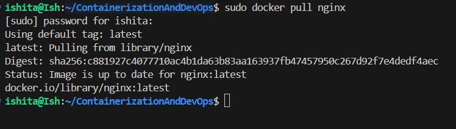
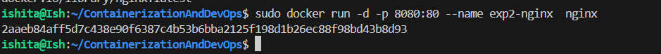
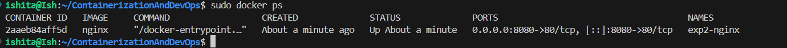
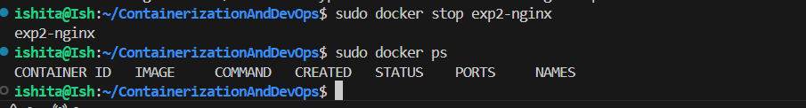
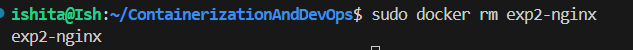
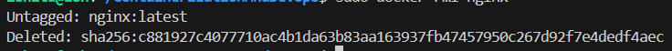

## **Experiment 2:** Docker Installation, Configuration and Image Management

### ***Objective:***
1. Pull docker images
2. Run Conatianers
3. Manage container lifecycle

### Implementation
1. Pull Image using the `docker pull nginx`
- This pulls the latest Nginx image from the Docker hub

2. Running the container with port mapping using the command `docker run -d -p 8080:80 nginx`
- It actually starts Nginx in the background mapped to port 8080

3. Verifying using the `docker ps` command
 
 
4. Stopping the running container using `docker stop` command

- Its clear from the `docker ps` command that there are no running containers

5. The `docker rm` command deletes the container

6. The `docker rmi` command is used to delete the image from my local device

### Result: Docker image pilled successfully and necessary commands were performed post container execution
