# Docker essentials - Dockerfile, .dockerignore, tagging and publishing 

## Objectives- Learn and implement docker essentials

## Part 1: Containerizing Apps with Dockerfiles

1.  Python flask app, which I named "app.py" under the **ish-flask-app** directory 

Commands- `mkdir ish-flask-app`

- Content of the **app.py** file 
``` python 
from flask import Flask
app = Flask(__name__)

@app.route('/')
def hello():
    return "Hello from Docker!"

@app.route('/health')
def health():
    return "OK"

if __name__ == '__main__':
    app.run(host='0.0.0.0', port=5000)  
```

- In the requirements.txt file - Flask==2.3.3

2. Creating a dockerfile with content:
``` Dockerfile
# Use Python base image
FROM python:3.9-slim

# Set working directory
WORKDIR /app

# Copy requirements file
COPY requirements.txt .

# Install dependencies
RUN pip install --no-cache-dir -r requirements.txt

# Copy application code
COPY app.py .

# Expose port
EXPOSE 5000

# Run the application
CMD ["python", "app.py"]
```


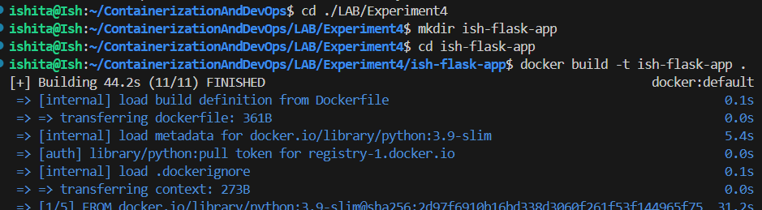


## Part2: Using .dockerignore 

- a ```.dockerignore``` file is nothing but a plain configuration file that helps in reducing image size as it prevents unnecesssary files from being copied

## Part3: Building Docker Images
1. Building image using the command `docker build -t ish-flask-app .` and verifying using the 'docker images` command

- build screenshot as shown above and verification as below

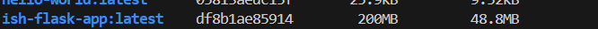
    
2. Tagging images 

- version number: `docker build -t ish-flask-app:1.0 .`
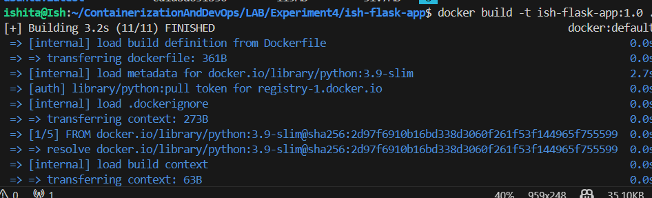

- with multiple tags: `docker build -t ish-flask-app:latest -t ish-flask-app:1.0 .`
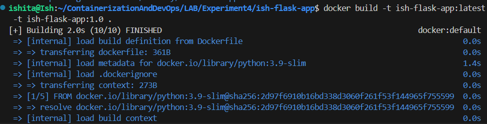

- with custom directory: `docker build -t ishcosmo/ish-flask-app:1.0 .`
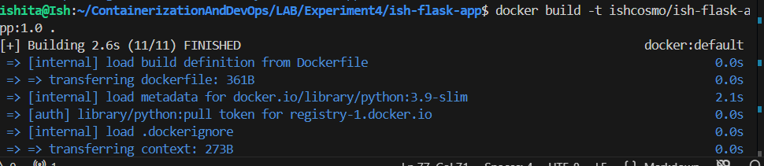

- tagging an existing image: `docker tag ish-flask-app:latest ish-flask-app:v1.0`

3. Viewing image details
- using `docker images`
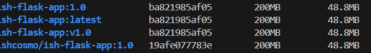

- using `docker history ish-flask-app`
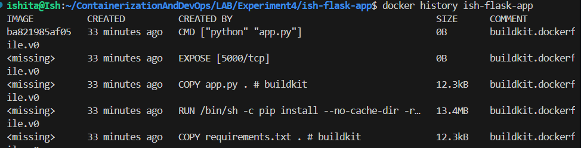

- inspecting using `docker inspect ish-flask-app`

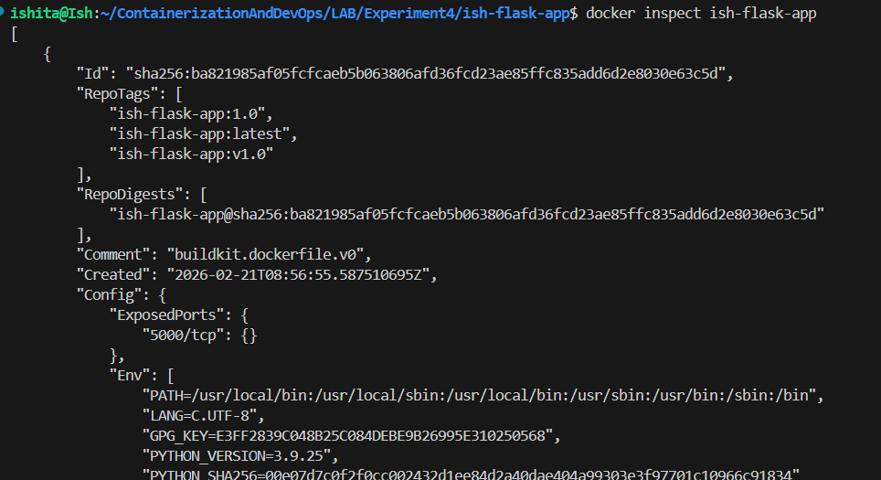

## Part4: Running containers

1. running container with port mapping using `docker run -d -p 5000:5000 --name flask-container ish-flask-app` 

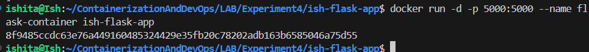

2. Testing the application using `curl http://localhost:5000`
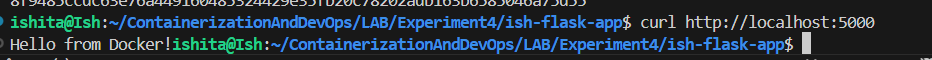
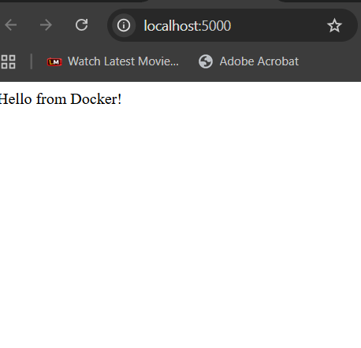

3. checking running containers using `docker ps`
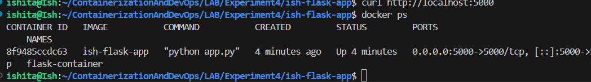

4. viewing container logs using `docker logs flask-container`
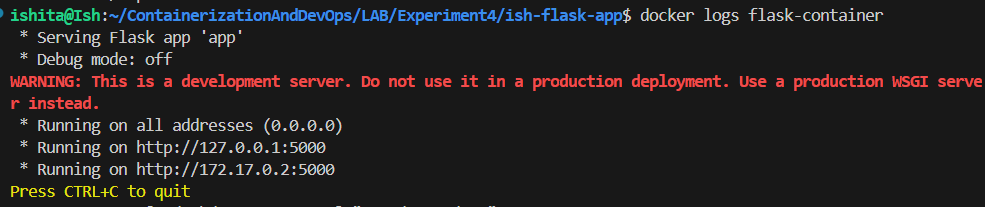

5. Stopping the container using `docker stop flask-container` and starting using `docker start flask-container`
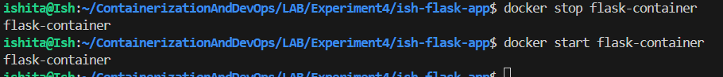

6. To remove a container use the command `docker rm flask-container` and to forcefully remove it use `docker rm -f flask-container`
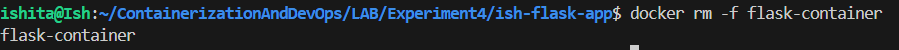

## Part 5: Multi-stage Builds

- Another dockerfile needs to be built 

```Dockerfile
# STAGE 1: Builder stage
FROM python:3.9-slim AS builder

WORKDIR /app

# Copy requirements
COPY requirements.txt .

# Install dependencies in virtual environment
RUN python -m venv /opt/venv
ENV PATH="/opt/venv/bin:$PATH"
RUN pip install --no-cache-dir -r requirements.txt

# STAGE 2: Runtime stage
FROM python:3.9-slim

WORKDIR /app

# Copy virtual environment from builder
COPY --from=builder /opt/venv /opt/venv
ENV PATH="/opt/venv/bin:$PATH"

# Copy application code
COPY app.py .

# Create non-root user
RUN useradd -m -u 1000 appuser
USER appuser

# Expose port
EXPOSE 5000

# Run application
CMD ["python", "app.py"]
```
- Building and comparing

- a regular image can be built using the command `docker build -t xyz . `
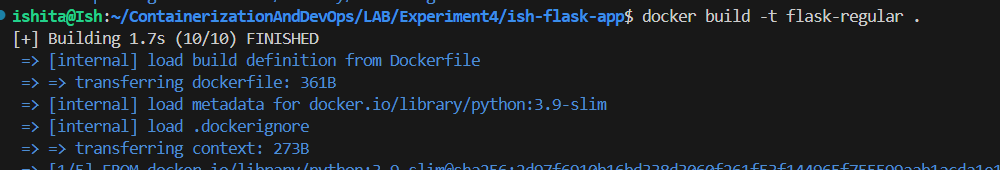
- a multistage image can be built using the command `docker build -f Dockerfile.multistage -t xyz .`
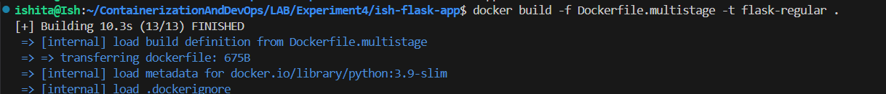

- comparing the sizes using command `docker images | grep flask-`
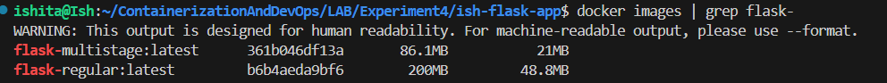

- Clearly a significant difference in image sizes are observed
(86 MB for multi and 200 for single)

## PART 6: Publishing to docker hub
- My username is **ishcosmo**

- Logging in using the command `docker login`
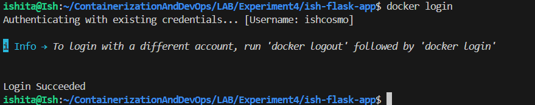

- Tagging image for docker hub via `docker tag ish-flask-app:latest ishcosmo/ish-flask-app:1.0` and `docker tag ish-flask-app:latest ishcosmo/ish-flask-app:latest`

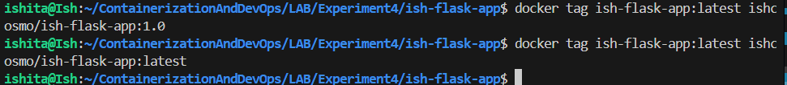
- Pushing to docker hub using `docker push` command

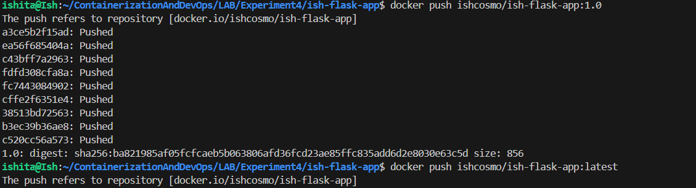
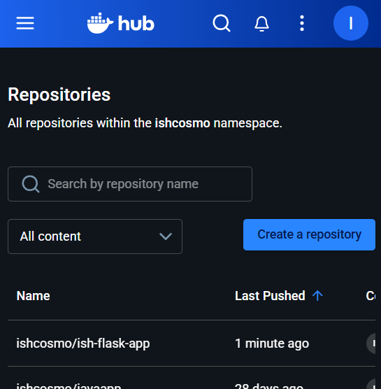

- Pulling from docker hub using `docker pull` running using the `docker run` command and finally verifying using the `docker ps` command

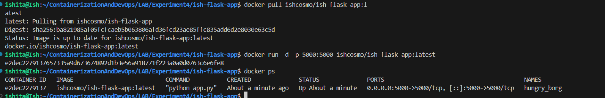

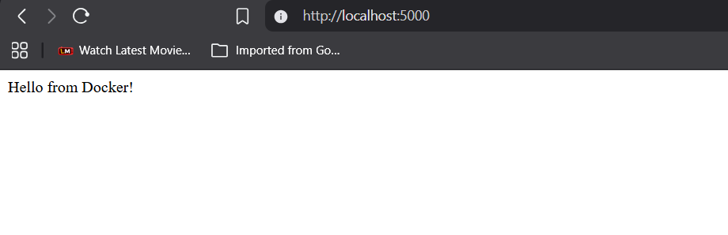

## Part 7: Node.js Example 

- Firstly a new directory that i named `ish-node-app` is created .
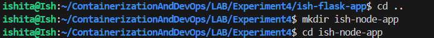
with a **app.js** and **package.json** file along with the neessary **Dockerfile** with the following content:

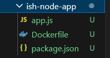
- app.js 
```js
const express = require('express');
const app = express();
const port = 3000;

app.get('/', (req, res) => {
    res.send('Hello from Node.js Docker!');
});

app.get('/health', (req, res) => {
    res.json({ status: 'healthy' });
});

app.listen(port, () => {
    console.log(`Server running on port ${port}`);
});

```
- package.json
```json
{
  "name": "node-docker-app",
  "version": "1.0.0",
  "main": "app.js",
  "dependencies": {
    "express": "^4.18.2"
  }
}

```
- Dockerfile
```Dockerfile
FROM node:18-alpine

WORKDIR /app

COPY package*.json ./
RUN npm install --only=production

COPY app.js .

EXPOSE 3000

CMD ["node", "app.js"]

```
- Building the image using `docker build -t ish-node-app .`
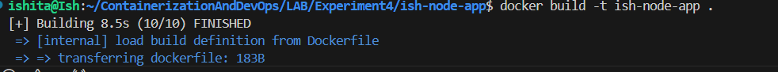

- Running the image using `docker run -d -p 3000:3000 --name node-container ish-node-app`


- testing the image using `curl http://localhost:3000`
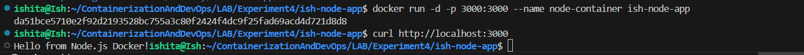

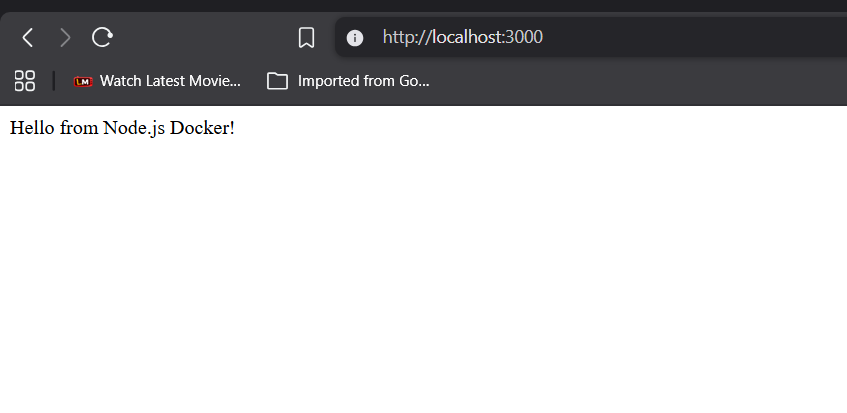

## PART 8: Exercises (practice)

1. To Create an image with three tags:
 - a. myapp:latest

- b. myapp:v2.0
 - c yourusername/myapp:production

- command used `docker build -t myapp:latest -t myapp:v2.0 -t ishcosmo/ish-flask-app:production .`
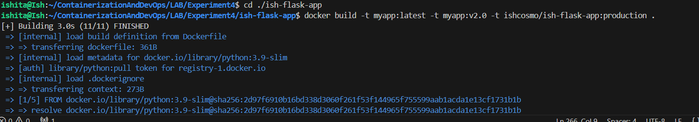

- what happens is it is a way to build a single Docker image and assign it multiple versions simultaneously..
- Instead of running the build process three separate times, Docker builds the image once and maps all three tags to the same unique Image ID.

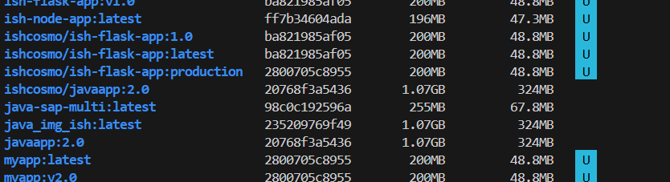
- cleary the 3 tags built have the same image id

2. Create a multi-stage Dockerfile for Node.js that:
 - a. Uses builder stage for npm install
- b. Creates final image with only production dependencies
- c. Uses non-root user

- buiding the dockerfile as below
```Dockerfile
# STAGE 1: Builder stage
FROM node:18-slim AS builder
WORKDIR /app
COPY package*.json ./
RUN npm install

# STAGE 2: Production stage
FROM node:18-alpine
WORKDIR /app
# Copy only package files for a clean production install
COPY --from=builder /app/package*.json ./
RUN npm install --only=production
# Copy application source code
COPY . .
# Create and switch to non-root user for security
RUN addgroup -S appgroup && adduser -S appuser -G appgroup
USER appuser
EXPOSE 3000
CMD ["node", "app.js"]
```

- Building by using `docker build -f Dockerfile.multi -t ish-node-app:latest -t ish-node-app:v2.0 -t ishcosmo/ish-node-app:production .` the concpet of triple tags is applied here

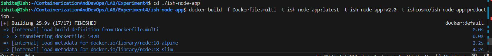

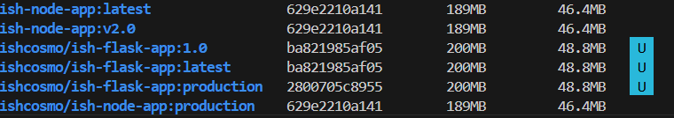

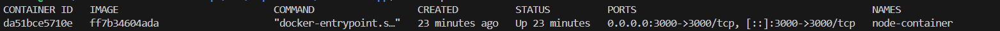

3. Clean Build
- using the `time docker build --no-cache -t clean-app .`
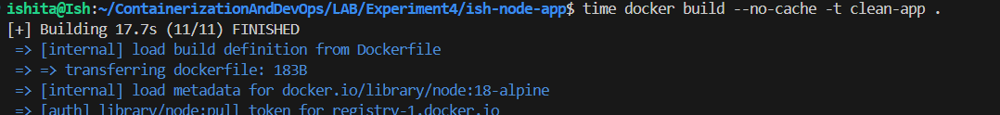
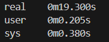

- using the `time docker build -t cached-app .`
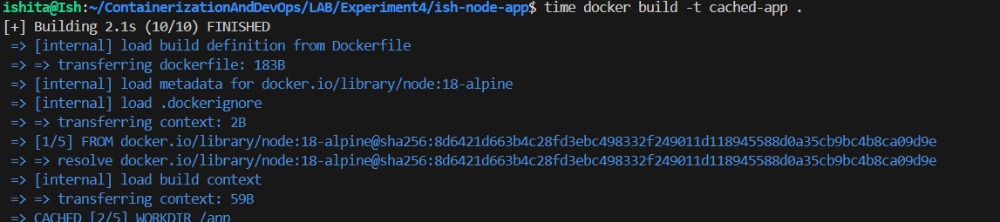
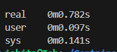


- Result: In the first command , it will take the longest time as Docker downloads every layer from scratch and then the cached one Docker reuses the layers from the previous build thats why it takes less time
