# Lab Experiment 7: CI/CD Pipeline using Jenkins, GitHub, and Docker Hub


## 1. Aim
To design and implement a complete CI/CD pipeline using **Jenkins**, integrating source code from **GitHub**, and automating the building and pushing of Docker images to **Docker Hub**.

## 2. Objectives
* Understand the CI/CD workflow using Jenkins (GUI-based tool).
* Create a structured GitHub repository with application code and a `Jenkinsfile`.
* Build Docker images from source code automatically.
* Securely store Docker Hub credentials in Jenkins.
* Automate the build and push process using GitHub Webhook triggers.
* Use the same host (Docker) as the Jenkins agent by mounting the Docker socket.

---

## 3. Implementation Details

### 3.1 Project Structure
The project is structured to follow a "Pipeline as Code" approach:
* `app.py`: Flask-based Python application.
* `requirements.txt`: Python library dependencies.
* `Dockerfile`: Instructions for containerizing the app.
* `Jenkinsfile`: Defines the CI/CD pipeline stages.

### Part A
### 3.2 Application Code (`app.py`)
```python
from flask import Flask
app = Flask(__name__)

@app.route("/")
def home():
    return "Hello from CI/CD Pipeline!, my sapid is 500119435"

if __name__ == "__main__":
    app.run(host="0.0.0.0", port=80)
```
### Dockerfile
```docker
FROM python:3.10-slim

WORKDIR /app
COPY . .

RUN pip install -r requirements.txt

EXPOSE 80
CMD ["python", "app.py"]
```

### Jenkinsfile
```
pipeline {
    agent any

    environment {
        
        IMAGE_NAME = "ishcosmo/my-app"
    }

    stages {

        stage('Clone Source') {
            steps {
                git: 'https://github.com/ishcosmo/my-app.git'
            }
        }

        stage('Build Docker Image') {
            steps {
                sh 'docker build -t $IMAGE_NAME:latest .'
            }
        }

        stage('Login to Docker Hub') {
            steps {
                withCredentials([string(credentialsId: 'dockerhub-token', variable: 'DOCKER_TOKEN')]) {
                    sh 'echo $DOCKER_TOKEN | docker login -u ishcosmo --password-stdin'
                }
            }
        }

        stage('Push to Docker Hub') {
            steps {
                sh 'docker push $IMAGE_NAME:latest'
            }
        }
    }
}
```
### PART B: Jenkins setup using Docker

- A *my-app* repository with all the files (dockerfile, composefile, Jenkinsfile, requirements file etc) was made for the setup with content as previously

- Start and Access Jenkins using
``` 
docker-compose up -d

```
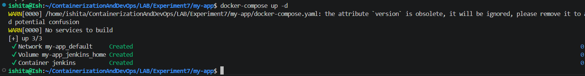
- For Access `http://localhost:8080
`
- Unlock Jenkins using:
```
docker exec -it jenkins cat /var/jenkins_home/secrets/initialAdminPassword

```
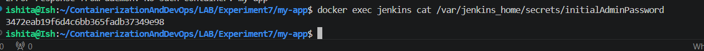
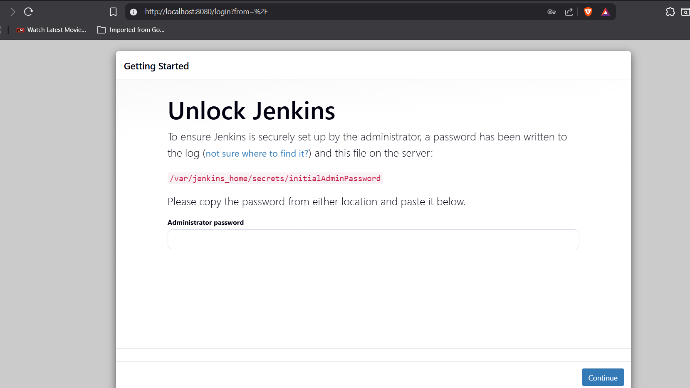
- followed by creating a new user (admin user)
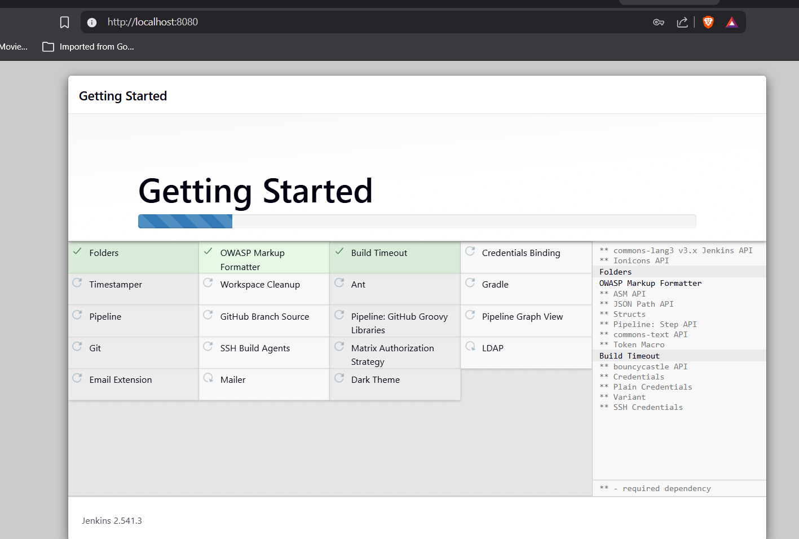
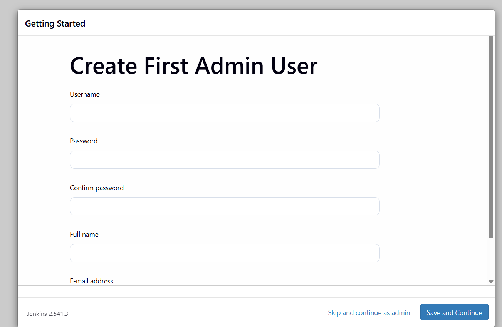
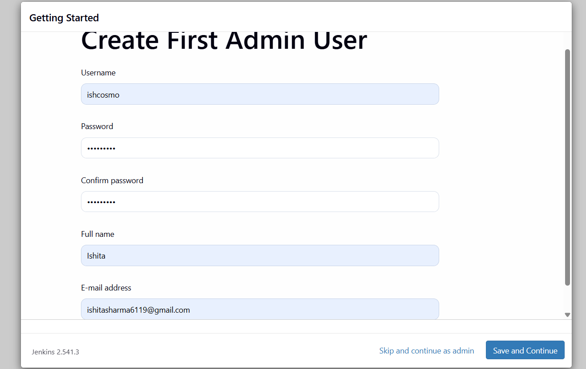
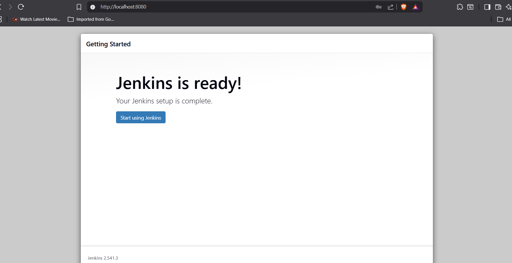
### PART C & D: Jenkins Configuration and Webhook Creation
- Adding Dockerhub credentials and then creating a pipelining job
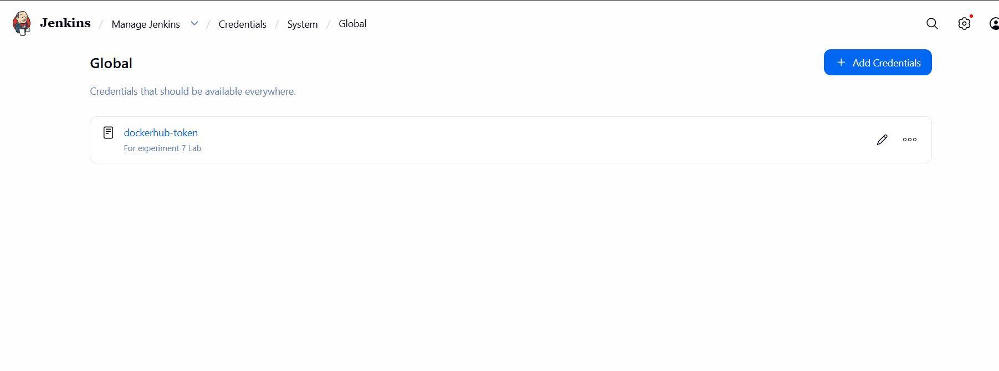
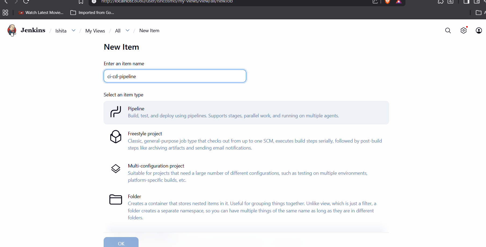
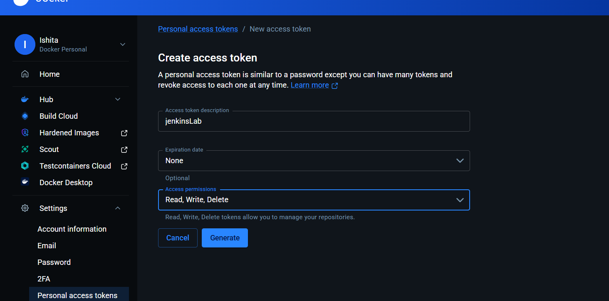
Since the Jenkins instance is running within **WSL (Windows Subsystem for Linux)**, it is not accessible to the public internet by default. **Localtunnel** was used to expose the local Jenkins service so GitHub could trigger the pipeline.

### 4.1 Localtunnel Implementation
To bypass command collisions and ensure a stable connection, the following commands were used:

1. **Installation:**
   ```bash
   npm install -g localtunnel
   ```
2. Establishing the Tunnel:
Exposing Jenkins (running on port 8080) to the internet:
```
npx localtunnel --port 8080
```
3. To automate the build process a Webhook was created in the GitHub repository settings:

- Payload URL: Formatted as: https://bright-tires-study.loca.lt/github-webhook/ (mine)
- Content Type: Changed from default to application/json for better compatibility with Jenkins.
- Trigger Events: Selected "Just the push event".

Verification: Upon clicking "Add Webhook," GitHub sent a ping payload. A Green Checkmark appeared, confirming that the tunnel successfully routed the request to the Jenkins container.

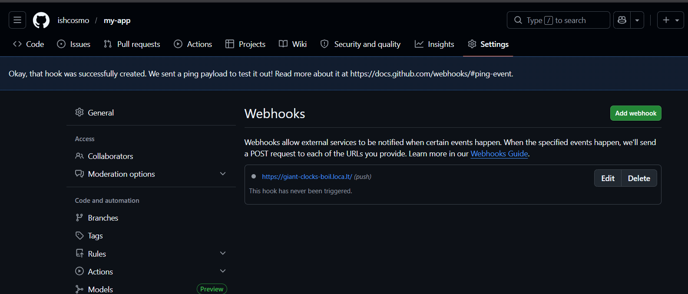

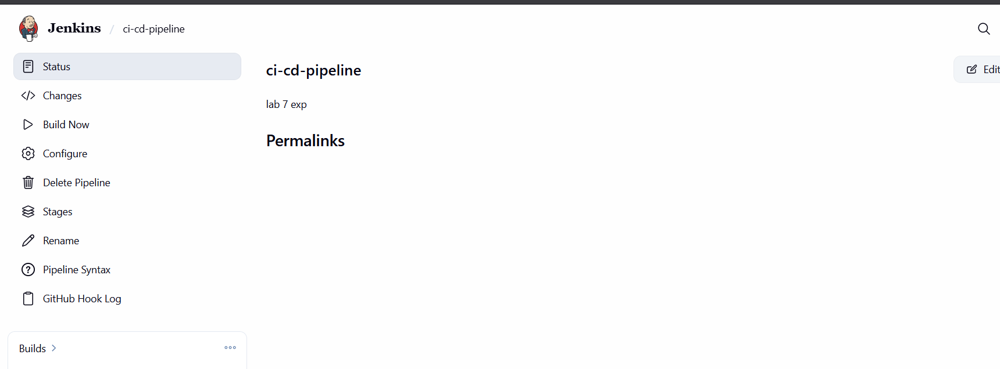

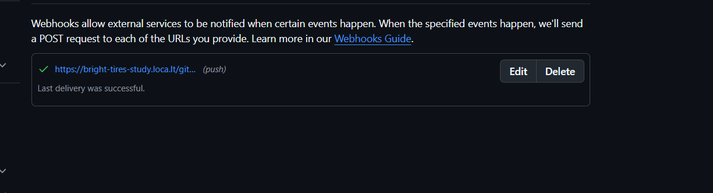

### PART E: Execution Flow

| Stage | Action | Description |
| :--- | :--- | :--- |
| **Stage 1** | **Code Push** | Developer pushes code changes to the GitHub repository |
| **Stage 2** | **Webhook Trigger** | GitHub detects the push and sends a JSON payload to the Localtunnel URL. |
| **Stage 3** | **Jenkins Processing** | Jenkins receives the signal, matches the repo URL, and initiates the pipeline. |
| **Stage 4** | **Clone & Build** | Jenkins pulls the code and builds the Docker image via the host's `/var/run/docker.sock`. |
| **Stage 5** | **Push to Registry** | The image is authenticated and pushed to the `ishcosmo/my-app` Docker Hub repository. |

- Build in Process
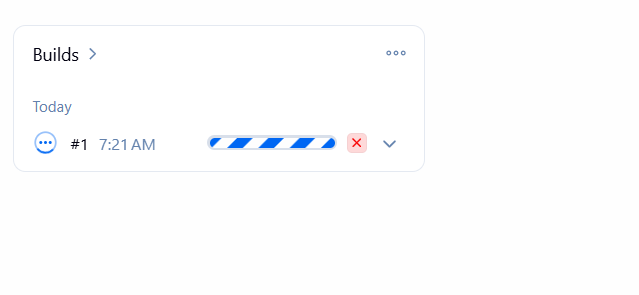
- Making a change to see if the pipeline works
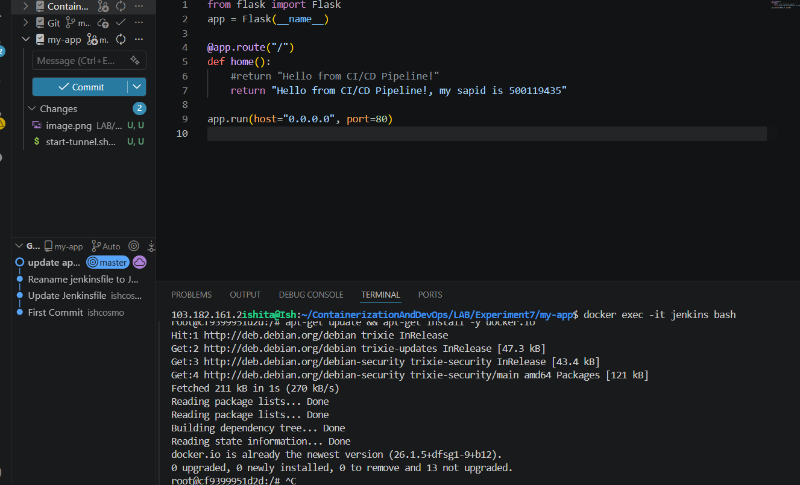
- execution build
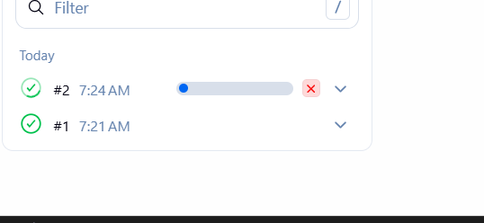
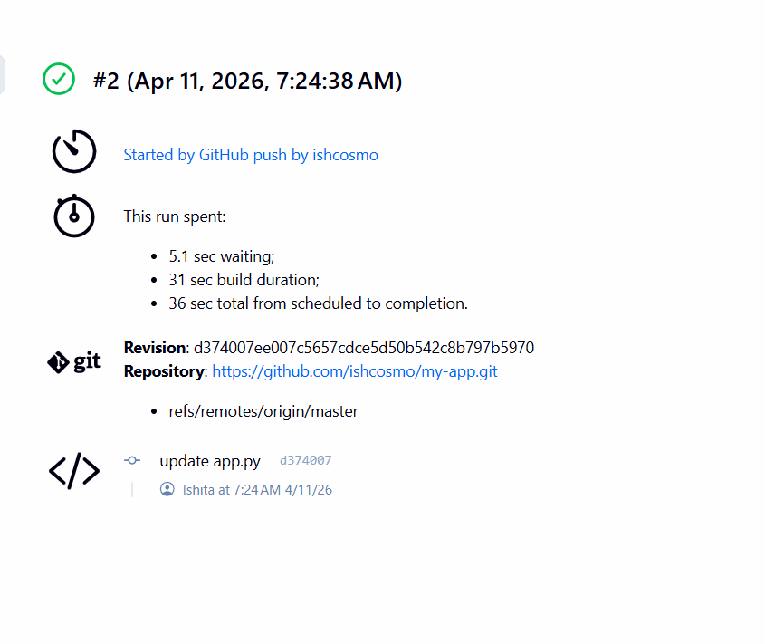

- Last stage where image can be seen on my dockerhub
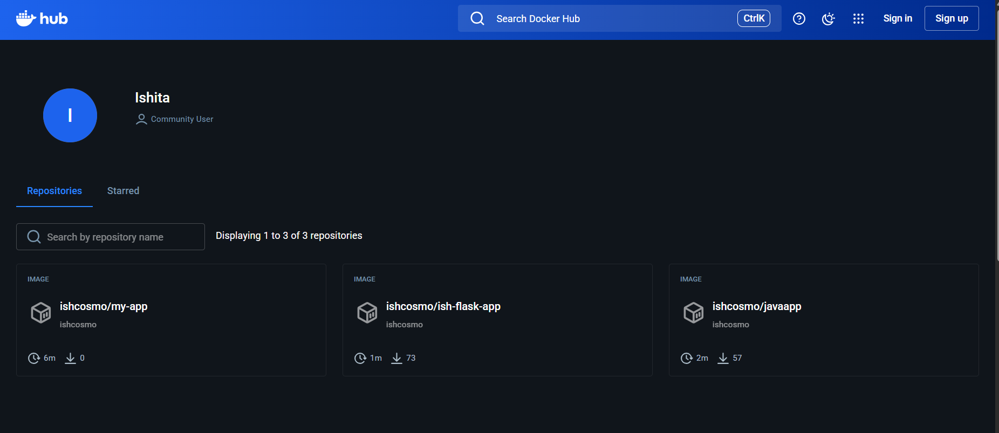

### Conclusion
- The implementation of this CI/CD pipeline successfully automates the transition from code to container.
- The use of Localtunnel effectively bridged the gap between a local WSL development environment and cloud-based triggers, while the "Same Host Agent" approach allowed Jenkins to perform high-performance Docker operations without nested virtualization overhead.