# Experiment 9: Ansible 

## Theory

### Problem Statement
Managing infrastructure manually across multiple servers leads to configuration drift, inconsistent environments, and time-consuming repetitive tasks. Scaling from one server to hundreds becomes nearly impossible with manual SSH-based administration.

### What is Ansible?
Ansible is an open-source automation tool for configuration management, application deployment, and orchestration.
- Follows an **agentless architecture**, using SSH for Linux and WinRM for Windows.
- Uses **YAML-based playbooks** to define automation tasks.
- Ansible enables cross-platform automation and orchestration at scale and has become the standard choice among enterprise automation solutions.

### How Ansible Solves the Problem
- **Agentless Architecture:** No software installation required on managed nodes
- **Idempotency:** Running playbooks multiple times yields the same result
- **Declarative Syntax:** Describe desired state, not the steps to achieve it
- **Push-based:** Initiates changes from control node immediately

### Key Concepts

| Component | Description |
|-----------|-------------|
| Control Node | Machine with Ansible installed |
| Managed Nodes | Target servers (no Ansible agent needed) |
| Inventory / `inventory.ini` | Defines the list of managed nodes (EC2 instances, servers, etc.) |
| Playbooks | YAML files containing a sequence of automation steps |
| Tasks | Individual actions in playbooks (e.g., installing a package) |
| Modules | Built-in functionality to perform tasks (e.g., `yum`, `apt`, `service`) |
| Roles | Pre-defined reusable automation scripts |

### How Does Ansible Work?
Ansible connects from the **control node** to the **managed nodes**, sending commands and instructions. Units of code executed on managed nodes are called **modules**. Each module is invoked by a **task**, and an ordered list of tasks forms a **playbook**. Managed machines are represented in a simple **inventory file** that groups nodes into categories. Ansible uses YAML — a human-readable format — and requires no extra agents on managed nodes.

---

## Part A — Ansible Installation on Windows (via WSL)

> **Note:** On Windows, Ansible runs through **Windows Subsystem for Linux (WSL)**. All commands below are executed inside a WSL terminal (Ubuntu).


### Step 1: Install Ansible inside WSL

```bash
# Update packages
sudo apt update -y

# Install Ansible
sudo apt install ansible -y

# Verify installation
ansible --version
```


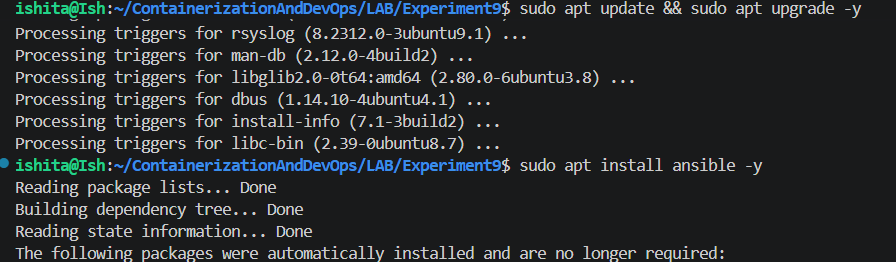

---

### Step 2: Test Local Ping

```bash
ansible localhost -m ping
```

**Expected Output:**
```
localhost | SUCCESS => {
    "changed": false,
    "ping": "pong"
}
```

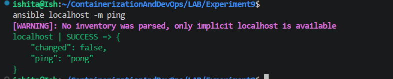
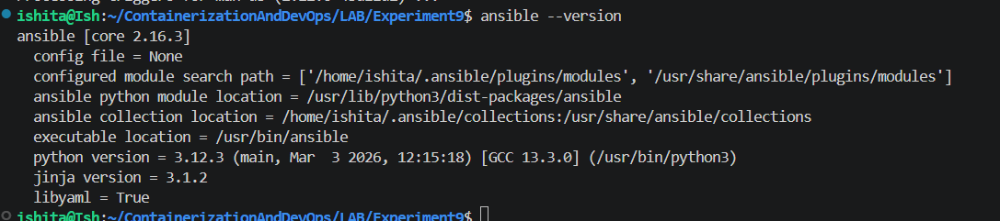

---

## Ansible Demo — Docker Containers as Servers

### Create SSH Key Pair in WSL

```bash
# Generate RSA key pair (accept defaults when prompted)
ssh-keygen -t rsa -b 4096

# This creates:
# Private key: ~/.ssh/id_rsa
# Public key:  ~/.ssh/id_rsa.pub

# Copy keys to current directory to be added to Docker images
cp ~/.ssh/id_rsa.pub .
cp ~/.ssh/id_rsa .
```

> **Windows Note:** Keep your keys inside the WSL filesystem (`~/.ssh/`). Placing them on the Windows NTFS filesystem (`/mnt/c/...`) can cause permission issues with SSH.

**Key placement summary:**

| File | Location | Purpose |
|------|----------|---------|
| `id_rsa` (Private Key) | Your local WSL machine | Used to authenticate when connecting to servers. **Never share this!** |
| `id_rsa.pub` (Public Key) | Remote server (`~/.ssh/authorized_keys`) | Grants access to anyone with the matching private key |


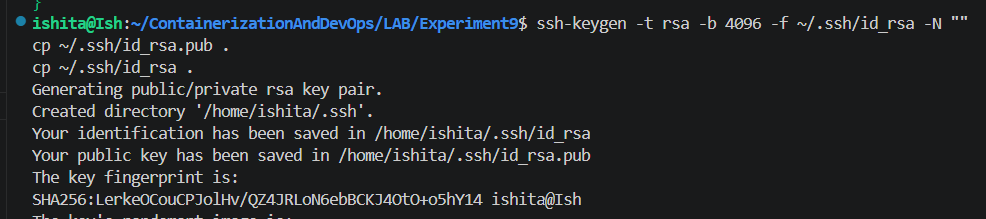

---

### Create Dockerfile for Ubuntu SSH Server

Create a file named `Dockerfile` in your working directory:

```dockerfile
FROM ubuntu
RUN apt update -y
RUN apt install -y python3 python3-pip openssh-server
RUN mkdir -p /var/run/sshd

# Configure SSH
RUN mkdir -p /run/sshd && \
    echo 'root:password' | chpasswd && \
    sed -i 's/#PermitRootLogin prohibit-password/PermitRootLogin yes/' /etc/ssh/sshd_config && \
    sed -i 's/#PasswordAuthentication yes/PasswordAuthentication no/' /etc/ssh/sshd_config && \
    sed -i 's/#PubkeyAuthentication yes/PubkeyAuthentication yes/' /etc/ssh/sshd_config

# Create .ssh directory and set proper permissions
RUN mkdir -p /root/.ssh && \
    chmod 700 /root/.ssh

# Copy SSH keys
COPY id_rsa /root/.ssh/id_rsa
COPY id_rsa.pub /root/.ssh/authorized_keys

# Set proper permissions for keys
RUN chmod 600 /root/.ssh/id_rsa && \
    chmod 644 /root/.ssh/authorized_keys

# Fix for SSH login
RUN sed -i 's@session\s*required\s*pam_loginuid.so@session optional pam_loginuid.so@g' /etc/pam.d/sshd

# Expose SSH port
EXPOSE 22

# Start SSH service when container starts
CMD ["/usr/sbin/sshd", "-D"]
```

---

### Build the Docker Image

```bash
# Build the Docker image
docker build -t ubuntu-server .

# Remove the public key from build directory (optional)
rm id_rsa.pub
```


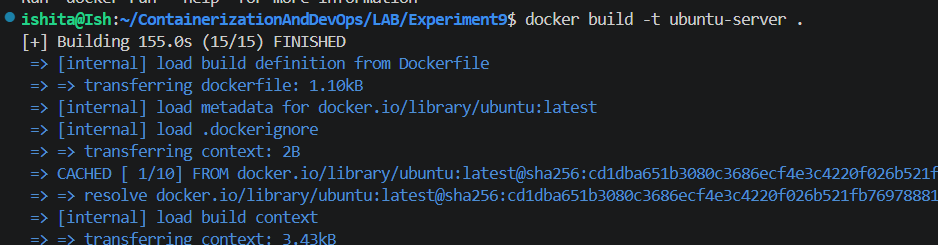

---

### Run the Docker Container

```bash
docker run -d -p 2222:22 --rm -p 8221:8221 --name ssh-test-server ubuntu-server
```

---

### Find the Container IP Address

```bash
docker inspect -f '{{range.NetworkSettings.Networks}}{{.IPAddress}}{{end}}' ssh-test-server
```

> Note this IP address (e.g., `172.17.0.4`).


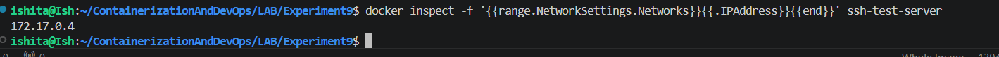

---

### Test SSH Connections

**Key-based authentication (recommended):**

```bash
ssh -i ~/.ssh/id_rsa root@localhost -p 2222
# Should log in without a password prompt
```

**Using container IP directly:**

```bash
ssh -i ~/.ssh/id_rsa root@172.17.0.2
```

> **Windows Note:** Always use `~/.ssh/id_rsa` (WSL path) rather than `/mnt/c/...` to avoid NTFS permission errors.


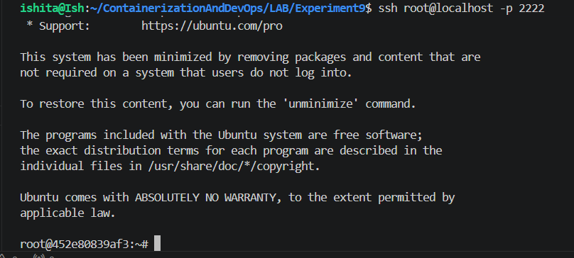

---

### Clean Up

```bash
docker stop ssh-test-server
docker rm ssh-test-server
```

---

## Ansible with Docker Exercise

### Step 1: Start 4 Server Containers

```bash
for i in {1..4}; do
    echo -e "\n Creating server${i}\n"
    docker run -d --rm -p 220${i}:22 --name server${i} ubuntu-server
    echo -e "IP of server${i} is $(docker inspect -f '{{range.NetworkSettings.Networks}}{{.IPAddress}}{{end}}' server${i})"
done
```


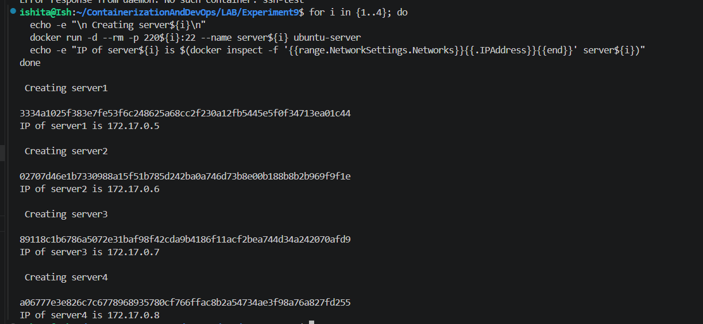

---

### Step 2: Create Ansible Inventory (`inventory.ini`)

```bash
# Get container IPs and write inventory
echo "[servers]" > inventory.ini
for i in {1..4}; do
    docker inspect -f '{{range.NetworkSettings.Networks}}{{.IPAddress}}{{end}}' server${i} >> inventory.ini
done

# Add inventory variables
cat << EOF >> inventory.ini
[servers:vars]
ansible_user=root
ansible_ssh_private_key_file=~/.ssh/id_rsa
ansible_python_interpreter=/usr/bin/python3
EOF
```
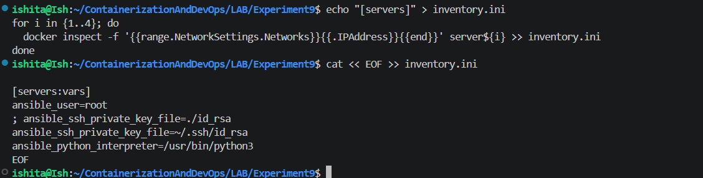
---

### Step 3: Review `inventory.ini`

```bash
cat inventory.ini
```

It should look like:

```ini
[servers]
172.17.0.3
172.17.0.4
172.17.0.5
172.17.0.6

[servers:vars]
ansible_user=root
; ansible_ssh_private_key_file=./id_rsa
ansible_ssh_private_key_file=~/.ssh/id_rsa
ansible_python_interpreter=/usr/bin/python3
```


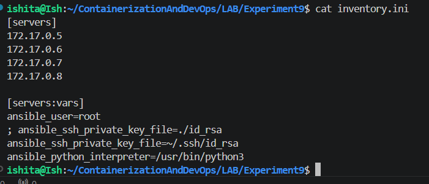

---

### Step 4: Test Connectivity

```bash
# Ansible ping test
ansible all -i inventory.ini -m ping

# Verbose mode (for troubleshooting)
ansible all -i inventory.ini -m ping -vvv
```


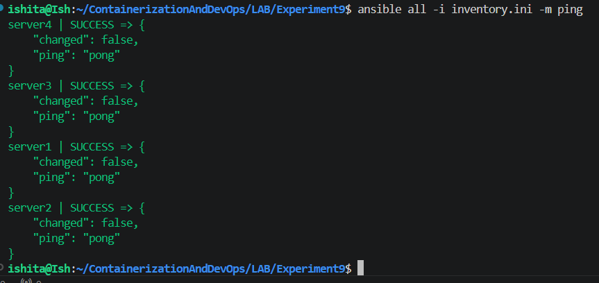

---

### Step 5: Create Playbook (`playbook1.yml`)

> The YAML file **must** start with exactly three dashes: `---`

```yaml
---
- name: Update and configure servers
  hosts: all
  become: yes
  tasks:
    - name: Update apt packages
      apt:
        update_cache: yes
        upgrade: dist

    - name: Install required packages
      apt:
        name: ["vim", "htop", "wget"]
        state: present

    - name: Create test file
      copy:
        dest: /root/ansible_test.txt
        content: "Configured by Ansible on {{ inventory_hostname }}"
```

---

### Step 6: Run the Playbook

```bash
ansible-playbook -i inventory.ini playbook1.yml
```

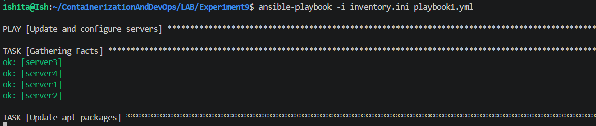

---

### Step 7: Verify Changes

```bash
# Using Ansible
ansible all -i inventory.ini -m command -a "cat /root/ansible_test.txt"

# Manually via Docker
for i in {1..4}; do
    docker exec server${i} cat /root/ansible_test.txt
done
```

**Screenshot — Verification output showing test file contents:**

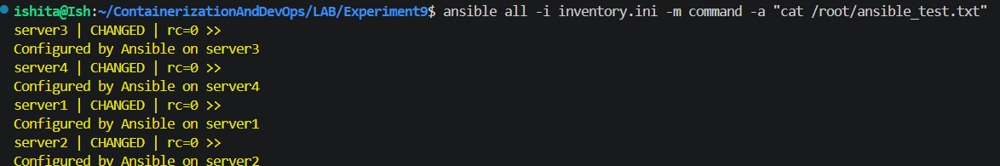

---

### Step 8: Cleanup

```bash
for i in {1..4}; do docker rm -f server${i}; done
```

---
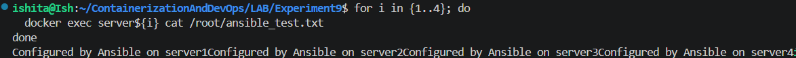

---

## Workflow Summary

```
1. Setup SSH keys
    ↓
2. Build Docker image
    ↓
3. Launch 4 containers
    ↓
4. Create inventory.ini
    ↓
5. Test connectivity (ansible ping)
    ↓
6. Run playbook
    ↓
7. Verify changes
    ↓
8. Cleanup containers
```

---

## The Need for Ansible in Server Management

1. **Scalability:** Managing multiple servers manually becomes impractical as infrastructure grows.
2. **Consistency:** Ensures identical configurations across all servers, reducing "works on my machine" issues.
3. **Efficiency:** Automates repetitive tasks, saving time and reducing human error.
4. **Idempotency:** Operations can be run multiple times without causing unintended changes.
5. **Infrastructure as Code:** Configuration is version-controlled and documented.

---

## Key Features of Ansible

1. **Agentless** – Uses SSH (no need to install software on managed nodes)
2. **Idempotent** – Ensures desired state without repeating changes unnecessarily
3. **YAML-Based Playbooks** – Simple, human-readable automation scripts
4. **Modules** – 3000+ built-in modules for cloud, containers, networking, etc.
5. **Push-Based** – Executes tasks from a control machine
6. **Infrastructure as Code (IaC)** – Supports declarative configuration management

---

