## Assignment 1:- Containerized Web Application with PostgreSQL using Docker Compose and Macvlan/Ipvlan

### Objective: 
Design, Containerize and deploy a web application using:
- PostgreSQL (Database)
- Backend API (here Node.js+Express)
- Docker multistage builds
- Separate Dockerfiles (database and Backend)
- Docker compose for orchestration
- Macvlan Networking

### Directory structure is as follows:

```text
project-assignment/
├── backend/
│   ├── main.py
│   └── Dockerfile
├── database/
│   └── Dockerfile
├── .dockerignore
└── docker-compose.yml
```

**Make the necessary files**

**Step 1: - The `package.json` will look as follows:**
```json
{
  "name": "task-service",
  "version": "1.0.0",
  "main": "server.js",
  "dependencies": {
    "express": "^4.18.2",
    "pg": "^8.11.3"
  }
}
```


**Step-2:- The `server.js` is as follows:-**
```js
const express = require('express');
const { Pool } = require('pg');
const app = express();
app.use(express.json());

const pool = new Pool({
  host: process.env.DB_HOST,
  user: process.env.DB_USER,
  password: process.env.DB_PASSWORD,
  database: process.env.DB_NAME,
  port: 5432,
});

// Auto-creates the table on startup
async function syncDatabase() {
  try {
    await pool.query(`
      CREATE TABLE IF NOT EXISTS tasks (
        id SERIAL PRIMARY KEY,
        content TEXT NOT NULL
      );
    `);
    console.log("Database table synchronized.");
  } catch (err) {
    console.error("Sync error:", err);
  }
}
syncDatabase();

app.get('/health', (req, res) => res.json({ status: 'active' }));

app.post('/tasks', async (req, res) => {
  const { content } = req.body;
  const result = await pool.query('INSERT INTO tasks (content) VALUES ($1) RETURNING *', [content]);
  res.status(201).json(result.rows[0]);
});

app.get('/tasks', async (req, res) => {
  const result = await pool.query('SELECT * FROM tasks');
  res.json(result.rows);
});

app.listen(3000, '0.0.0.0', () => console.log('Backend listening on port 3000'));
```


**Step-3:- The backend/`Dockerfile` is as follows:-**
```dockerfile
# Stage 1: Build dependencies
FROM node:20-alpine AS build_env
WORKDIR /app
COPY package*.json ./
RUN npm install

# Stage 2: Final runtime
FROM node:20-alpine
WORKDIR /app
# Security: Use a non-root user
RUN addgroup -S devgroup && adduser -S devuser -G devgroup
COPY --from=build_env /app/node_modules ./node_modules
COPY . .
RUN chown -R devuser:devgroup /app
USER devuser
EXPOSE 3000
CMD ["node", "server.js"]
```

**Step-4:- The `.dockerignore` will look as follows:-**
```text
node_modules
npm-debug.log
.git
```


**Step-5:- The database/`Dockerfile` will look as follows:-**
```dockerfile
FROM postgres:15-alpine
LABEL type="custom-db"

```
- **and the sql table looks like follows**
```SQL
CREATE TABLE IF NOT EXISTS users(
    id SERIAL PRIMARY KEY,
    name TEXT
);
```

**Step-6:- The `docker-compose.yml`is as follows:-**
```yaml
version: '3.8'

services:
  app-db:
    build: ./database
    container_name: task_db_container
    environment:
      POSTGRES_USER: admin_user
      POSTGRES_PASSWORD: password_2026
      POSTGRES_DB: task_db
    volumes:
      - task_data:/var/lib/postgresql/data
    networks:
      app_vlan:
        ipv4_address: 192.168.20.10
    healthcheck:
      test: ["CMD-SHELL", "pg_isready -U admin_user -d task_db"]
      interval: 5s
      timeout: 5s
      retries: 5

  app-backend:
    build: ./backend
    container_name: task_backend_container
    depends_on:
      app-db:
        condition: service_healthy
    environment:
      DB_HOST: 192.168.20.10
      DB_USER: admin_user
      DB_PASSWORD: password_2026
      DB_NAME: task_db
    networks:
      app_vlan:
        ipv4_address: 192.168.20.20

networks:
  app_vlan:
    external: true

volumes:
  task_data:
```


**Step-7:- Create Network**
```bash
docker network create -d macvlan \
  --subnet=192.168.20.0/24 \
  --gateway=192.168.20.1 \
  -o parent=eth0 \
  app_vlan
```
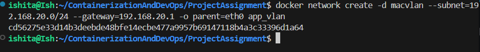


**Step-8:- Build from Compose and start services**
```bash
docker-compose up -d --build
```
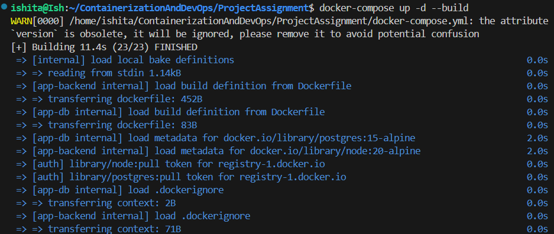
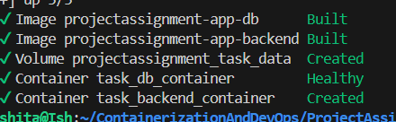

**Step-9:- Insert A User in DB in API**
```bash
docker exec -it task_backend_container node -e "fetch('http://localhost:3000/api/tasks', {method:'POST', headers:{'Content-Type':'application/json'}, body:JSON.stringify({content:'Ishita'})}).then(r => r.json()).then(console.log)"
```
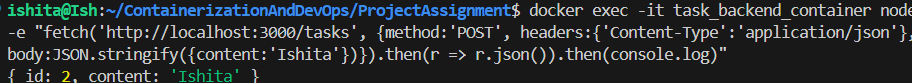


**Step-10:- GET or fetch User API**
```bash
docker exec -it task_backend_service node -e "fetch('http://localhost:3000/api/tasks').then(r => r.json()).then(console.log)"
```
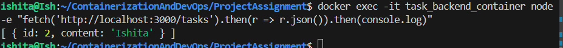


**Step-11:- List Running Container**
```bash
docker ps
```
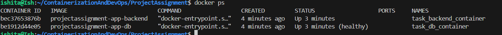


**Step-12:- List Volumes**
```bash
docker volume ls 
```
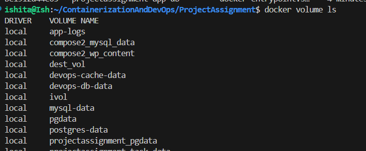


**Step-18:- Inspect**
```bash
docker inspect projectassignment-app-backend
```
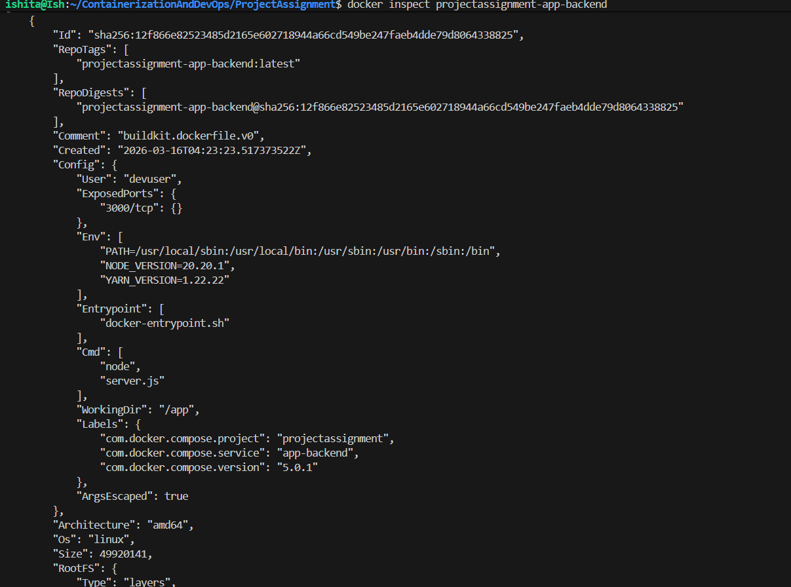


```bash
docker inspect projectassignment-app-db
```
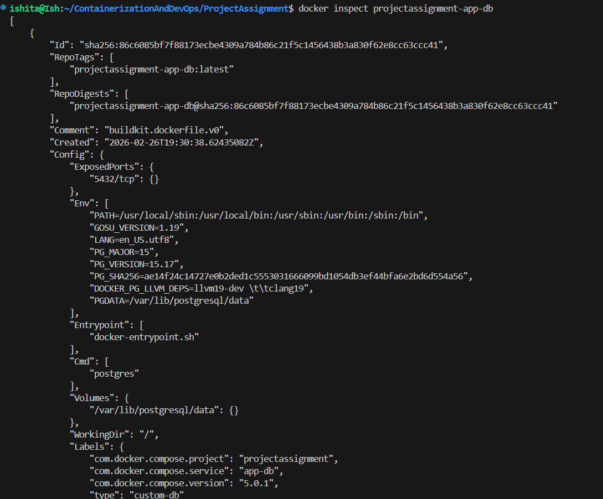


**Step-19:- Verify Data Persistence**
This step will verify that data stored in DB is permanently saved irrespective of the state of the container.
```bash
docker-compose down
docker-compose up -d
docker exec -it node_backend node -e "fetch('http://localhost:3000/users', {method:'POST', headers:{'Content-Type':'application/json'}, body:JSON.stringify({name:'Ishita'})}).then(r => r.text()).then(console.log)"

```
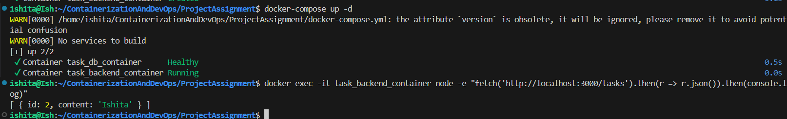


## Report


**_Technical Analysis & Build Optimization_**

- To ensure the system is production-ready, I implemented several advanced Docker optimization strategies focused on performance, security, and resource management.

- **Multi-Stage Build Pattern**: I utilized a two-stage build process for the Node.js backend. The initial "builder" stage handles the heavy lifting—dependency resolution and environment setup—while the final "runtime" stage only inherits the production-ready binaries. This effectively stripped away nearly 800MB of build tools and caches that would otherwise bloat the production environment.

- **Lightweight Base Image Selection**: By opting for node:20-alpine over the standard Debian-based image, I leveraged the minimalism of Alpine Linux. This reduced the attack surface and significantly lowered the image footprint, ensuring near-instant container startup and reduced bandwidth consumption during deployments.

- **Build Context Refinement**: I implemented a .dockerignore file to strictly define the build context. By excluding local node_modules, git history, and environment secrets, I ensured that the build process is both faster and more secure, preventing local junk files from polluting the image layers.

- **Non-Root Privilege**: Adhering to the principle of least privilege, the containers are configured to run under a dedicated, non-privileged user. This ensures that even in the event of an application-level vulnerability, an attacker would lack the root permissions required to compromise the host system.-


<br>

**_Network Design Diagram_**

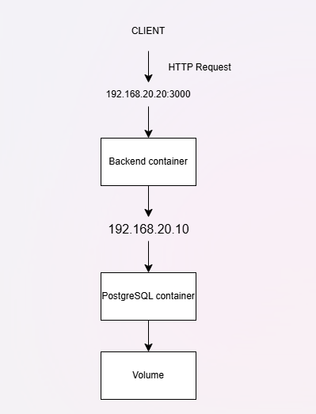


<br>


**_Image Size Analysis_**

Efficiency in containerization is often measured by image portability. Below is the comparison of the standard vs. optimized images used in this project:

- node:20 => 1.1 GB
- node:20-alpine => 180 MB
The transition to an Alpine-based multi-stage build resulted in a a significaant reduction in image size


**_Macvlan Vs IPvlan_**

| Feature | MACVLAN | IPVLAN |
|--------|---------|--------|
| MAC assignment | Unique MAC per container | All share host's MAC  |
| Network switch impact| High (Switch must learn multiple MACs) | Lower (switch sees olny one MAC) |
| Scalability | Limited by switch | Highly scalable |
| Use case | Legacy apps,Small deployments | Modern and Large-scale deployments |