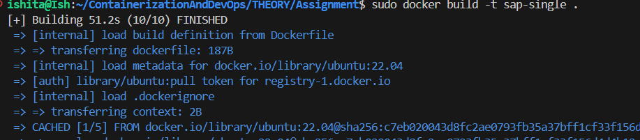

## **C Script in docker**

- Dockerfile for single stage build
```Dockerfile
FROM ubuntu:22.04 AS build
RUN apt-get update && apt-get install -y gcc
WORKDIR /app
COPY hello.c .
RUN gcc -static -o hello hello.c
CMD ["./hello"]
```
- The C file displaying SAPID is as follows:
``` C
#include <stdio.h>
#include <string.h>

int main() {
    char stored_sapid[] = "500119435";
    char user_input[20];

    while (1) {
        printf("Enter your SAP ID: ");
        scanf("%s", user_input);

        if (strcmp(user_input, stored_sapid) == 0) {
            printf("Matched\n");
            break; 
        } else {
            printf("Not Matched\n");
        }
    }
    return 0;
}
```
- Finally on building:


- Checking image size via single stage build:


