### Class Assignment 25-03-26  Run and manage a "Hello Web App" (httpd)

### Objective: Deploy and manage a simple Apache-based web server

### 1. Deploying a Simple Web Application (Apache httpd)
#### 1.1 Run a pod
 - I started by creating a pod using the official `httpd` (Apache) image from Docker Hub.

```bash
kubectl run apache-pod --image=httpd
```
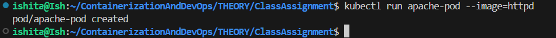
- To verify The following command was used
```bash
kubectl get pods
```
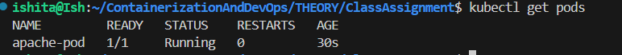

#### 1.2 Inspecting the pod 
```bash
kubectl describe pod apache-pod
```
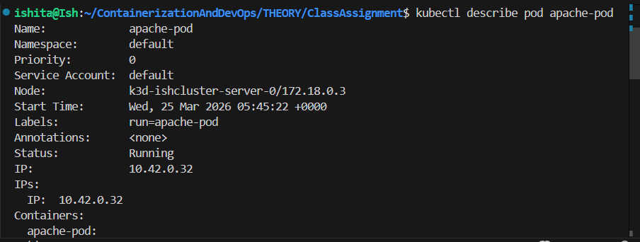

#### 1.3 Accessing the pod 
```bash
kubectl port-forward pod/apache-pod 8081:80
```
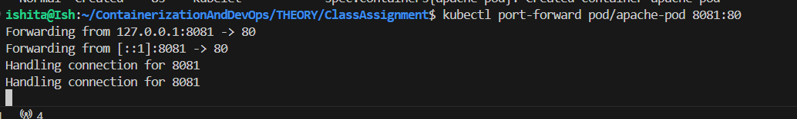
- Then opening in browser using
```bash
http://localhost:8081
```
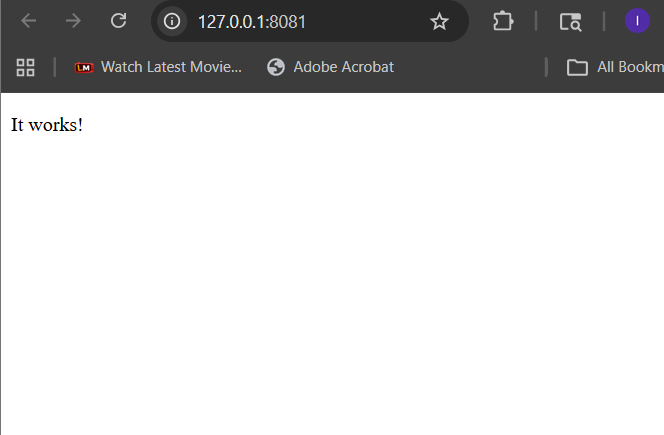

#### 1.4 Deleting the pod
```bash
kubectl delete pod apache-pod
```
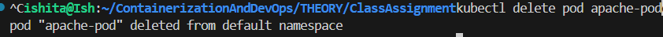

### 2. Convert to deployment

- Now started by creating a deployment using the official `httpd` (Apache) image from Docker Hub. This creates a managed instance of the web server.

```bash
kubectl create deployment apache --image=httpd
```
- the following commads were used  for verification
```bash
kubectl get deployments
kubectl get pods
```
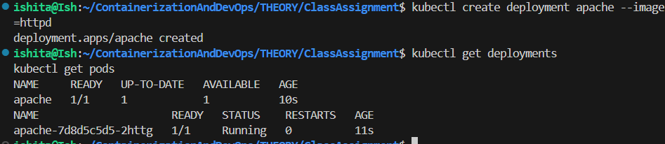
- To allow traffic to reach pods, expose the deployment using a Service. This provides a stable IP and acts as a basic load balancer.
```bash
kubectl expose deployment apache --port=80 --type=NodePort
```
and then for accessing
```bash
kubectl port-forward service/apache 8082:80
```
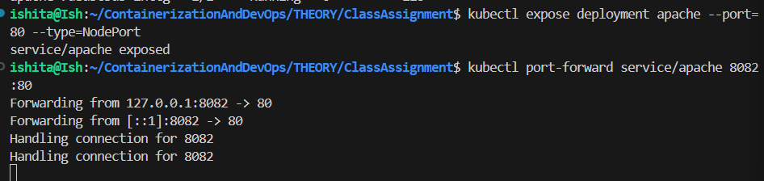


### 3. Modifying behaviour

- Scaling allows the application to handle more concurrent users

- the command below scales the replicas to 2
```bash
kubectl scale deployment apache --replicas=2
```
- and verifying again by using
```bash
kubectl get pods
```
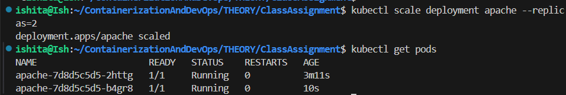

- Using port-forwarding to bridge the cluster service to local machine to verify traffic flow
```bash
kubectl port-forward service/apache 8080:80
```

- by monitoring logs with ```kubectl logs -l app=apache -f --prefix``` its  confirmed that successive browser refreshes at localhost:8080 were distributed across both running pods.
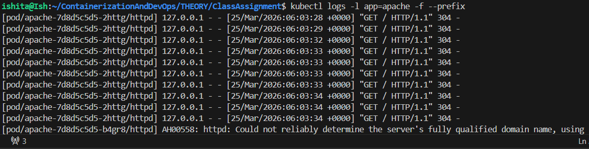

### 4. Debugging scenario + Cleanup
- To simulate a real-world troubleshooting scenario I intentionally updated the deployment with a non-existent image to observe how Kubernetes handles errors

- I updated the deployment container image to a name that does not exist in the registry:
```bash
kubectl set image deployment/apache httpd=wrongimage
```
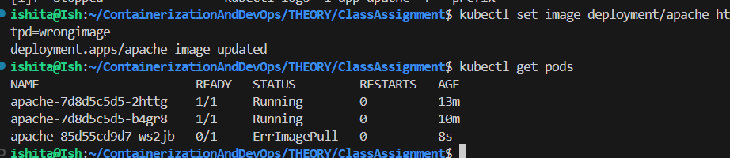

- Using the describe command, I inspected the events to identify why the pod failed to start
```bash
kubectl describe pod <pod-name>
```

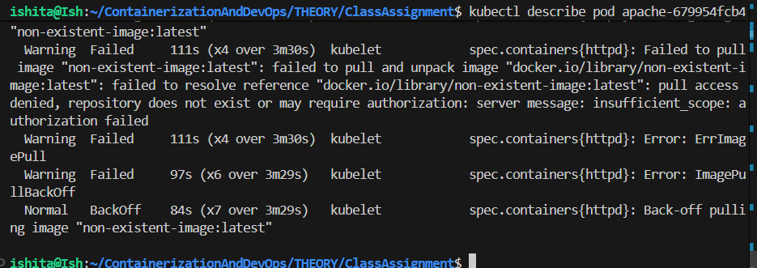
- Findings:

- Warning Failed: Kubernetes tried to pull = non-existent-image:latest.

- Error: ErrImagePull followed by ImagePullBackOff.

- Reason: Repository does not exist or requires authorization.

- I fixed the deployment by setting the image back to the valid httpd image. Kubernetes immediately terminated the broken pod and brought the service back to a healthy state by using
```bash
kubectl set image deployment/apache httpd=httpd
```
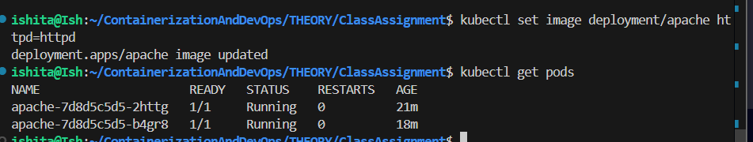

- To verify the internal configuration, I entered the container's shell to inspect the file system where Apache serves content
```bash
kubectl exec -it <pod-name> -- /bin/bash
ls /usr/local/apache2/htdocs
exit
```
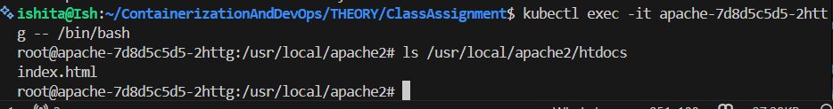

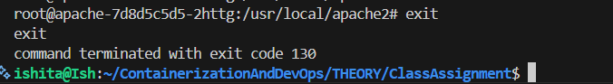

- Once the testing was complete, I deleted the deployment and the service to release cluster resources
```bash
kubectl delete deployment apache
kubectl delete service apache
```
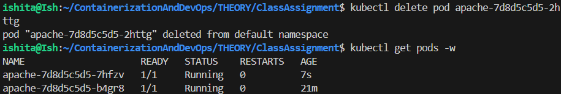
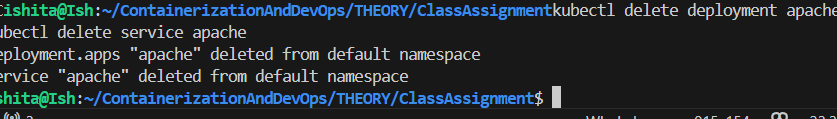


