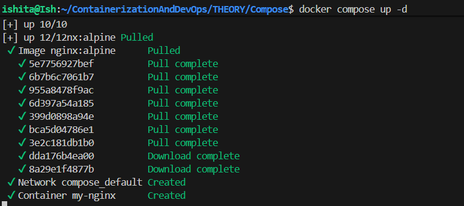
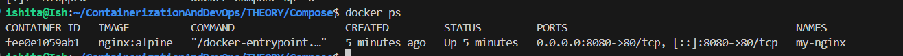
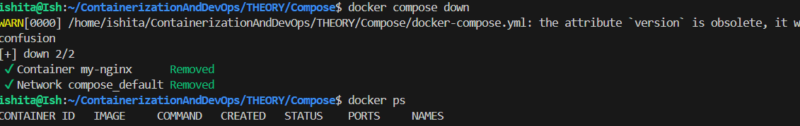
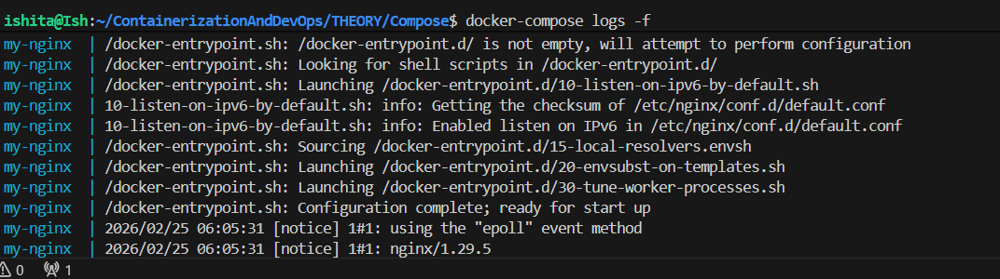
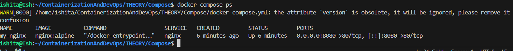

# Docker Compose , Run
1. Making a YAML file with the following contents
```yaml
version: '3.8'
services:
  nginx:
    image: nginx:alpine          # Image name (same as in docker run)
    container_name: my-nginx     # --name my-nginx
    ports:
      - "8080:80"               # -p 8080:80
    volumes:
      - ./html:/usr/share/nginx/html  # -v ./html:/usr/share/nginx/html
    environment:
      - NGINX_HOST=localhost    # -e NGINX_HOST=localhost
    restart: unless-stopped     # --restart unless-stopped
    # Note: -d flag in docker run = detached mode
    # In docker-compose, use: docker-compose up -d
```
- Using the command `docker compose up -d` builds, creates, and starts all services defined in your docker-compose.yml file, while the `docker compose down` command stops and removes /stops those resources





- now again using  `docker compose up` without the flag -d

- using `docker compose logs` for statically seeing the logs and add the flag -f for live monitoring and continuous updating logs


- on server side logging is important to analyse services and what they are generating

- using the command `docker compose ps` tells the running/stop/status of the service in the docker compose file


- after `docker compose down` and then ps command shows nothing as expected
