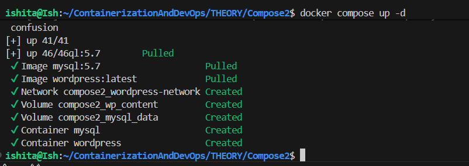
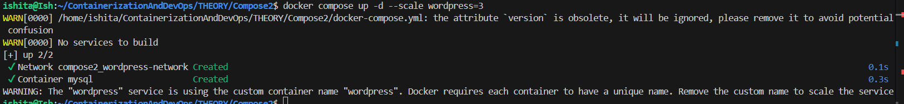
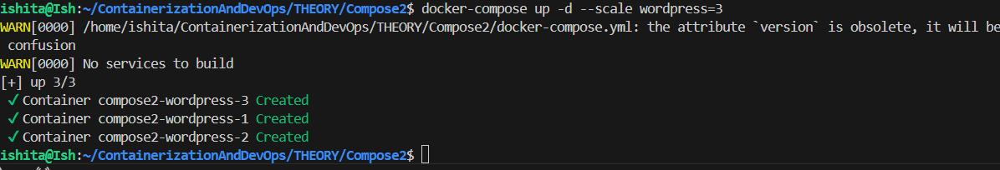
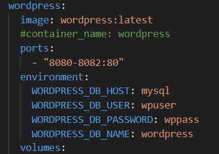

## Using Docker Compose with multiple containers : SQL,Wordpress

- Using the yaml file as below
```yaml
# docker-compose.yml
version: '3.8'

services:
  mysql:
    image: mysql:5.7
    container_name: mysql
    environment:
      MYSQL_ROOT_PASSWORD: secret
      MYSQL_DATABASE: wordpress
      MYSQL_USER: wpuser
      MYSQL_PASSWORD: wppass
    volumes:
      - mysql_data:/var/lib/mysql
    networks:
      - wordpress-network

  wordpress:
    image: wordpress:latest
    container_name: wordpress
    ports:
      - "8080:80"
    environment:
      WORDPRESS_DB_HOST: mysql
      WORDPRESS_DB_USER: wpuser
      WORDPRESS_DB_PASSWORD: wppass
      WORDPRESS_DB_NAME: wordpress
    volumes:
      - wp_content:/var/www/html/wp-content
    depends_on:
      - mysql
    networks:
      - wordpress-network

volumes:
  mysql_data:
  wp_content:

networks:
  wordpress-network:
```

-Now according to this yaml file volumes and networks are being made and depends_on means the wordpress service depends on sql so in precedence sql comes first and then wordpress.

- Wordpress container can be scaled and sql one cant be as first one is stateless and latter is stateful
- Stateless can be dealt with docker 
- Scale means default docker compose = 1 container for each servcie 
- `scale wordpress=3` means 3 containers will be created and its being scaled up 
- now all three containers are running on port 80
- if one got bind, or using the port so all 3 will be working but only 1 will be accessed 

- CHALLENGE: Service access
- Change for it will be:
- range is given and ports can be mapped easily  but the problem is port switching will be required
- It needa to be done internally
- Therefore we can let docker map port randomly


- Using command `docker compose up -d --scale wordpress=3`




To resolve this a few changes were to be made in the yaml file
port was changed and customized name was removed

- Expose "3000" preferable for scaling (docker can access container via dns (container name+port))
- in such case in every container service is running on this 3000 port 
- using docker discovery all ports can be easily discovered

- LOAD BALANCE can tehrefore be externally done and can be done via docker


- New change- in yaml file remove port and do expose 80 and add a new service nginx 
- nginx can be a load balancer and request proxy to handle requests
- define a config - nginx file and service will start after wordpress
uses the same nw as initial one


