# Docker Swarm 

#### 1. Why Do We Need Docker Swarm ?

If we run containers using:

```bash
docker run nginx
```

*Problems encountered are-*

* Runs on single machine only
* No automatic recovery if container crashes
* No scaling across multiple servers
* No built-in load balancing
* Manual management


##### 2. Feature Highlights of Docker Swarm

* Built into Docker Engine (no extra installation)
* Declarative service model
* Automatic load balancing
* Rolling updates
* Service scaling
* Self-healing containers
* Routing mesh
* Secure by default (TLS between nodes)


**Step-1: Initialize Swarm**
```bash
docker swarm init
```
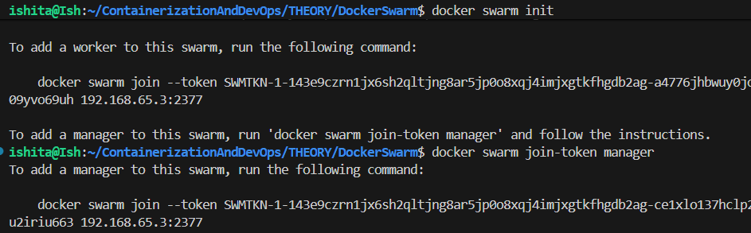

_Explanation:-_
* `docker` → Docker CLI
* `swarm` → Swarm management command
* `init` → Initialize a new swarm cluster


**Step-2: Verify Node**
```bash
docker node ls
```
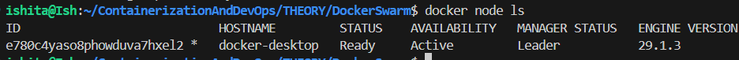

### Explanation

* `node` → Manage swarm nodes
* `ls` → List nodes

**Step-3: Create Service**
```bash
docker service create \
  --name webapp \
  --replicas 3 \
  -p 8080:80 \
  nginx
```
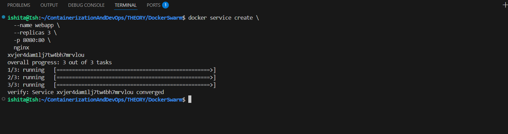

_Explanation:-_
* `docker service` → Manage swarm services
* `create` → Create new service
* `--name webapp` → Assign service name
* `--replicas 3` → Run 3 container instances
* `-p 8080:80` → Publish port
  * 8080 → Host port
  * 80 → Container port
* `nginx` → Image name


**Step-4: Check Services**
```bash
docker service ls
```
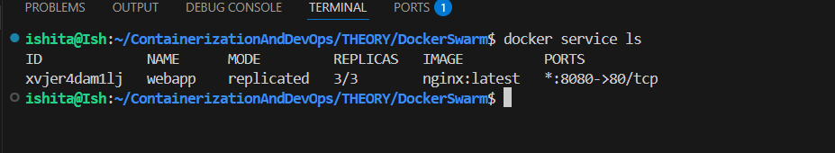

* `ls` → List all services


**Step-5: List Containers**
```bash
docker service ps webapp
```
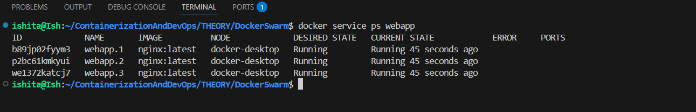

* `ps` → Show tasks (containers) of service
* `webapp` → Service name


**Step-6:- Inspect Services**
```bash
docker service inspect webapp
```
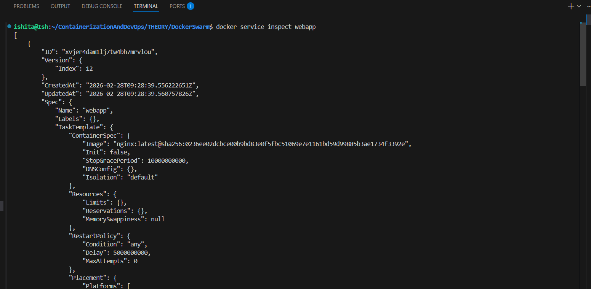


_Explanation:-_
* `inspect` → Show detailed JSON configuration
* Useful for debugging


**Step-7:- For formatted output:**
```bash
docker service inspect --pretty webapp
```
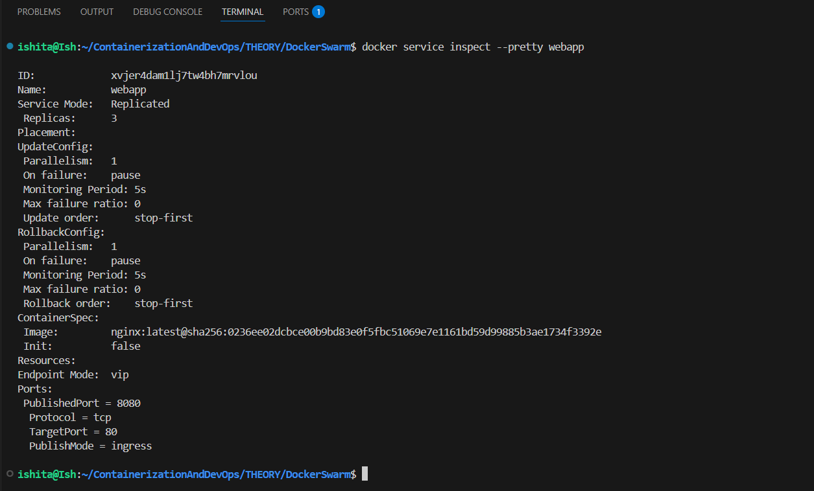

* `--pretty` → Human-readable format


**Step-8:- Scale the Service**
Traffic increased during sale → need 6 replicas.

```bash
docker service scale webapp=6
```
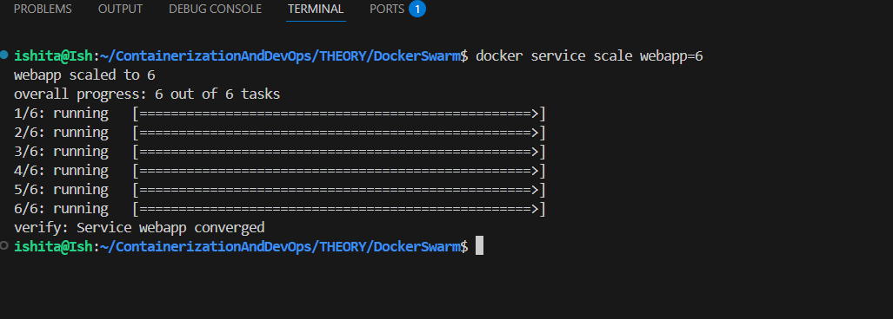

_Explanation:-_
* `scale` → Change replica count
* `webapp=6` → Desired replicas


**Step-9:- Verify:**
```bash
docker service ls
```
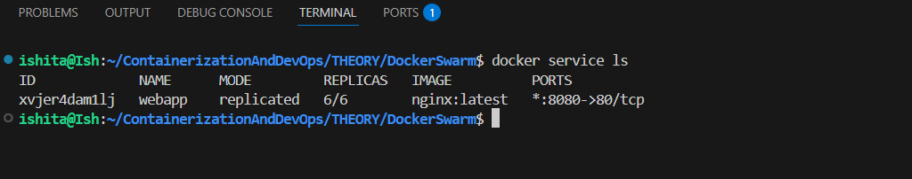

> Swarm automatically:
* Creates new containers
* Distributes them across nodes


**Step-10:- Delete the Service**
```bash
docker service rm webapp
```
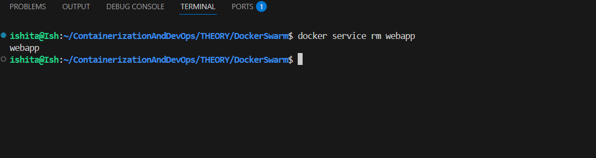

_Explanation:-_
* `rm` → Remove service
* Deletes all replicas automatically


**Step-11:- Verify that services Stop or Not**
```bash
docker service ls
```
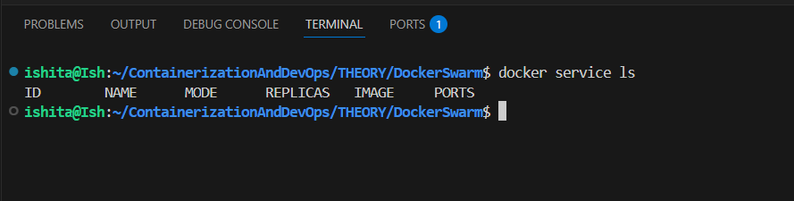


#### Summary of Core Commands

| Action          | Command                                 |
| --------------- | --------------------------------------- |
| Init swarm      | docker swarm init                       |
| Join swarm      | docker swarm join                       |
| List nodes      | docker node ls                          |
| Create service  | docker service create                   |
| List services   | docker service ls                       |
| Inspect service | docker service inspect                  |
| Scale service   | docker service scale                    |
| Update service  | docker service update                   |
| Drain node      | docker node update --availability drain |
| Remove service  | docker service rm                       |


#### Real Industry Use Case Example

E-commerce Website:

| Layer           | Swarm Usage                 |
| --------------- | --------------------------- |
| Frontend        | 5 replicas                  |
| Backend API     | 4 replicas                  |
| Redis           | 3 replicas                  |
| Database        | Stateful service            |
| Rolling updates | During deployments          |
| Node drain      | During hardware maintenance |


#### `Docker Run` vs `Docker Swarm`

| Feature             | docker run       | Docker Swarm (docker service) |
| ------------------- | ---------------- | ----------------------------- |
| Scope               | Single container | Cluster-managed service       |
| Environment         | Single host      | Multi-node cluster            |
| Scaling             | Manual           | Automatic                     |
| Load balancing      | No               | Yes                           |
| Self-healing        | No               | Yes                           |
| Rolling updates     | No               | Yes                           |
| Desired state model | No               | Yes                           |
| Production-ready    | Limited          | Yes                           |


#### Common Flags (Same Purpose, Different Context)

| Purpose        | docker run       | docker service create | Notes                   |
| -------------- | ---------------- | --------------------- | ----------------------- |
| Name           | `--name`         | `--name`              | Same                    |
| Publish Port   | `-p`             | `-p`                  | Swarm uses routing mesh |
| Environment    | `-e`             | `-e`                  | Same                    |
| Mount Volume   | `-v` / `--mount` | `--mount`             | Slight syntax diff      |
| Network        | `--network`      | `--network`           | Swarm uses overlay      |
| Detach         | `-d`             | Default               | Swarm runs detached     |
| Restart policy | `--restart`      | `--restart-condition` | Swarm more advanced     |


#### Different Flags (Swarm-Specific)

These DO NOT exist in `docker run`:

| Swarm Flag             | Purpose                     |
| ---------------------- | --------------------------- |
| `--replicas`           | Number of containers        |
| `--mode`               | replicated / global         |
| `--update-delay`       | Rolling update delay        |
| `--update-parallelism` | Update concurrency          |
| `--constraint`         | Node placement              |
| `--limit-cpu`          | Resource limit cluster-wide |
| `--reserve-memory`     | Resource reservation        |
| `--with-registry-auth` | Pass registry credentials   |
| `--placement-pref`     | Spread tasks                |


#### docker run Architecture

User → Docker Engine → Container

Single machine only.


#### Docker Swarm Architecture

User → Manager Node → Scheduler → Worker Nodes → Tasks

Cluster-based.


#### Final Summary

| Capability           | docker run | Docker Swarm  |
| -------------------- | ---------- | ------------- |
| Runs container       | Yes        | Yes (as task) |
| Multi-node           | No         | Yes           |
| Scaling              | Manual     | Built-in      |
| Auto-healing         | No         | Yes           |
| Rolling updates      | No         | Yes           |
| Routing mesh         | No         | Yes           |
| Placement rules      | No         | Yes           |
| Resource scheduling  | Basic      | Advanced      |
| Production readiness | Limited    | Yes           |
