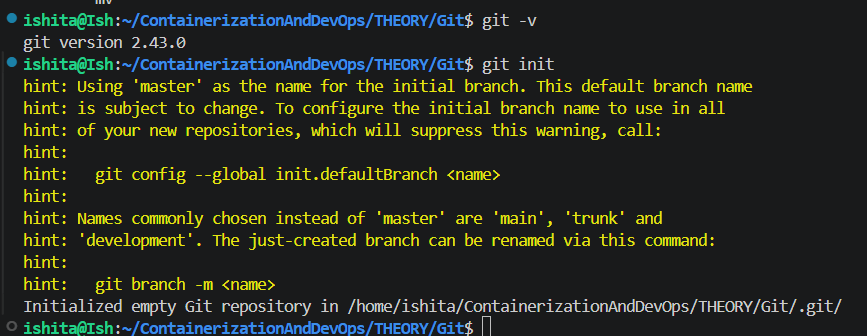
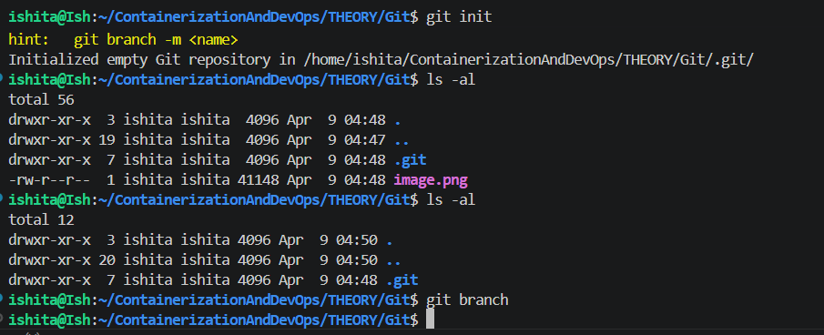
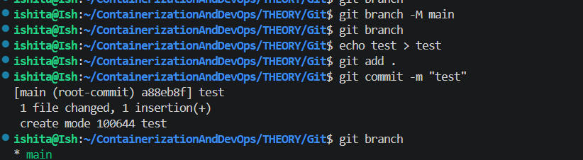
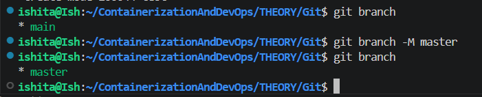
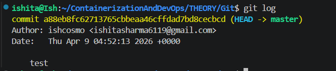
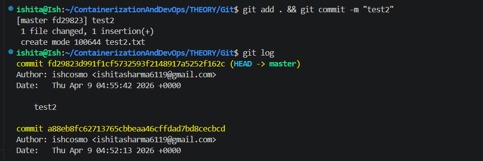
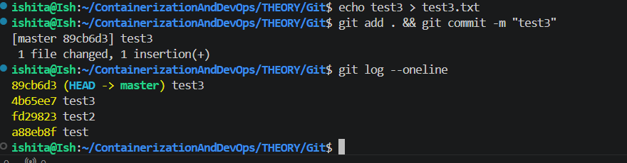
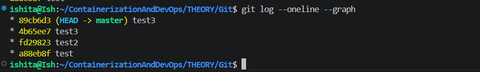
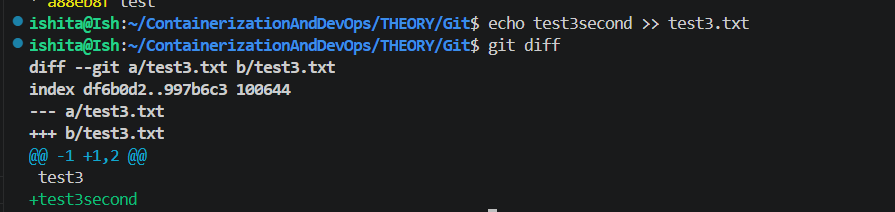

### GitHub and Git

- earlier master and now main is default 
- git branch didnt work until a change was made here echo test
- then renamed it master
 - "* main" means presently working here
 - line by line observation is done by git
 - when main was made secind time everything that was there uptil ghead was xopied in main
 - post img 15 we are aiming to change in test 2
- jab tak no overlapping we can merge

