K3D, K3S and KUBECTL

1. Firslty post intsallation, when we run the command below a cluster is created where in docker container (which is acting as a node) k3s runs which is actually done by K3D (lightweight wrapper to run K3S in docker to avoid us cretaing cluster manually)
- `k3d cluster create ishcluster` creates cluster called ishcluster

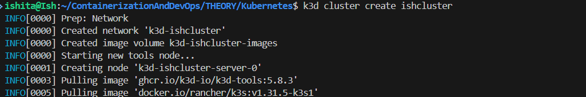

### TASK 1
- Using command `kubectl get nodes` we see the created nodes
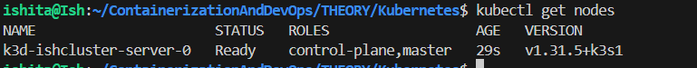

- Below image shows successful creation
- 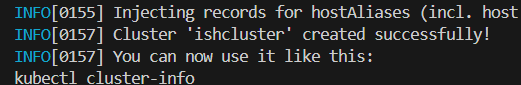

2. To view available clusters use `kubectl config get-contexts`

- 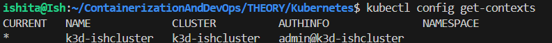

### TASK 2

- to view running pods `kubectl get pods`
- 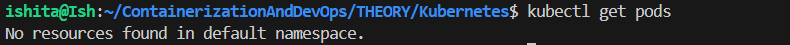
- This shows there isnt any yet

### TASK 3
- To run a container using `kubectl run nginx --image=nginx`
-  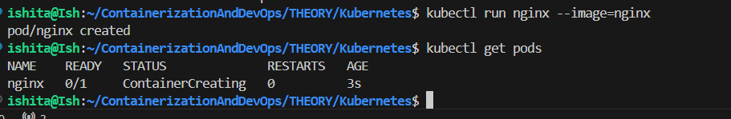
- here the previous command shows running pod as well 

### TASK 4
- To view pod details using `kubectl describe pod nginx`
-  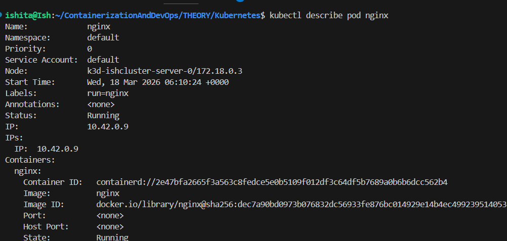

### TASK 5
- To display container logs using `kubectl logs nginx`
-   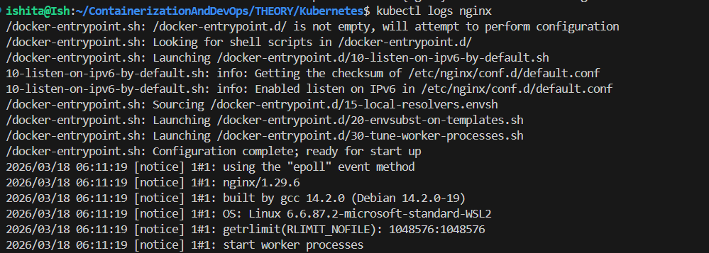

### TASK 6
- To create a deployment using `kubectl create deployment web --image=nginx`

-   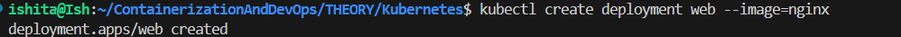

### TASK 7
- Using `kubectl scale deployment web --replicas=3` for scaling or creating multiple pods

-   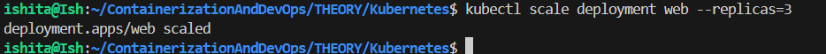

### TASK 8
- Using `kubectl expose deployment web --port=80 --type=NodePort` to create a service so application becomes accessible

-   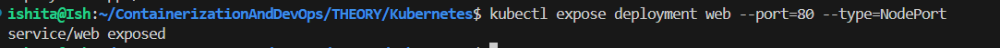

### TASK 9
- To show how applications are exposed use `kubectl get services`
-   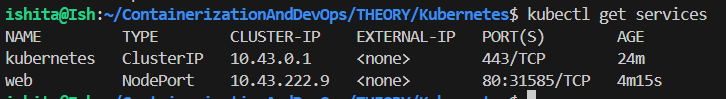
### TASK 10

- Delete resources using `kubectl delete pod nginx` and `kubectl delete deployment web`

-    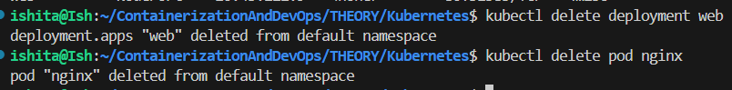

