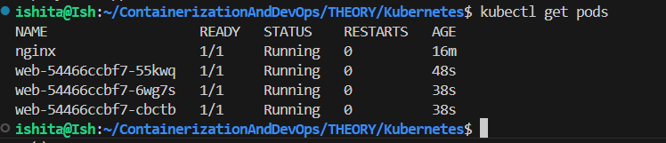
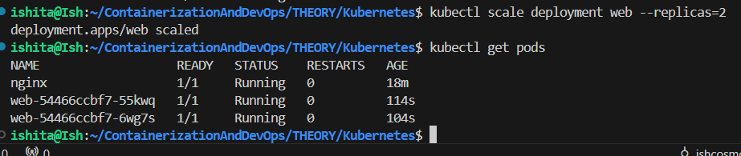
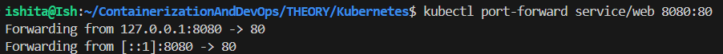
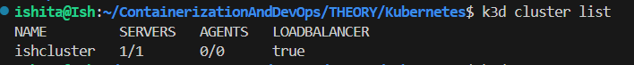

K3D, K3S and KUBECTL

1. Firslty post intsallation, when we run the command below a cluster is created where in docker container (which is acting as a node) k3s runs which is actually done by K3D (lightweight wrapper to run K3S in docker to avoid us cretaing cluster manually)
- `k3d cluster create ishcluster` creates cluster called ishcluster

### TASK 1
- Using command `kubectl get nodes` we see the created nodes

- Below image shows successful creation
- 

2. To view available clusters use `kubectl config get-contexts`

- 

### TASK 2

- to view running pods `kubectl get pods`
- 
- This shows there isnt any running yet 
- Pod can be completely replicated

### TASK 3
- To run a container using `kubectl run nginx --image=nginx`
- This image is available on docker hub and we didn't change the name for identification purposes
- "nginx" after run can be named anything this is actually for identification 
- This command is equivalent to docker run command
-  
- here the previous command shows running/getting ready pod as well 

### TASK 4
- To view pod details using `kubectl describe pod nginx`
-  
- Useful in debugging to observe error

### TASK 5
- To display container logs using `kubectl logs nginx`
- similar to `docker logs`
-   

### TASK 6
- To create a deployment using `kubectl create deployment web --image=nginx`
- web here is the name
- If we use run its just replicating docker so benefits weren't there 
- Therefore we use create rather run to reap the benefots such as healing, automation (start), rollling updates, scaling

-   

### TASK 7
- Using `kubectl scale deployment web --replicas=3` for scaling or creating multiple pods
- Using this multiple hosts have multiple containers running doing the same thing 
- if requirement is low we can again scale down as well 

-   
- verifying using `kubectl get pods`
-   

- scaling down by just specifying replicas lets say 2 here
-   

### TASK 8
- Using `kubectl expose deployment web --port=80 --type=NodePort` to create a service so application becomes accessible
- Port is fixed and the way we want it to map is specified by type

-   
- we Can further use Ingress
- port-forward is a temporary command (generally for testing)
-    

### TASK 9
- To show how applications are exposed use `kubectl get services`
- deployment itself means services 
-   
- The AWS instance we created = the cluster IP
### TASK 10

- Delete resources using `kubectl delete pod nginx` and `kubectl delete deployment web`

-    
- we can also delete the cluster as well

### RECAP

- Yesterday the clusters made still exist and since we obtained 1/1 meaning its still up
- on using command `k3d cluster list` we get :
-    

