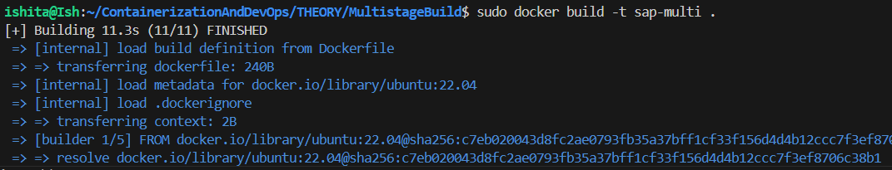
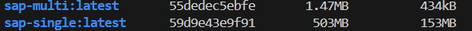

## **C Script in docker**

- Dockerfile for Multistage build
```Dockerfile
FROM ubuntu:22.04 AS builder
RUN apt-get update && apt-get install -y gcc
WORKDIR /build
COPY hello.c .
RUN gcc -static -o hello hello.c

FROM scratch
COPY --from=builder /build/hello .
CMD ["./hello"]
```
- The C file displaying SAPID is as follows: **(copied)**
``` C
#include <stdio.h>
#include <string.h>

int main() {
    char stored_sapid[] = "500119435";
    char user_input[20];

    while (1) {
        printf("Enter your SAP ID: ");
        scanf("%s", user_input);

        if (strcmp(user_input, stored_sapid) == 0) {
            printf("Matched\n");
            break; 
        } else {
            printf("Not Matched\n");
        }
    }
    return 0;
}
```
- Finally on building:


- Checking image size via single stage build:


## **Observations**
- The difference in size observed (503MB vs. 1.47MB) is a direct result of how layers were managed.

- Single-Stage Build: All layers created during the process—including the heavy GCC compiler and build tools—stayed in the final image, resulting in a large 503MB file.

- Multi-Stage Build: One set of layers were used to compile the code and then discarded. What was copied - only the final, tiny binary into a fresh scratch image. This removed all the unnecessary "build-time" layers, leaving with a highly optimized 1.47MB image.
