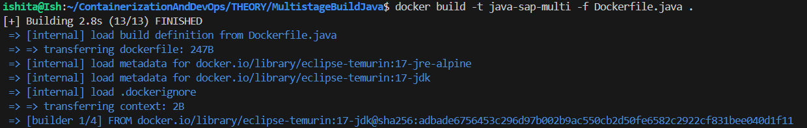
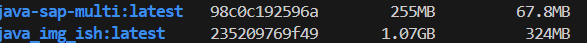

## ** Java Script in Docker (Multistage)**

- Dockerfile for Multistage build (Dockerfile.java)
```Dockerfile

FROM eclipse-temurin:17-jdk AS builder
WORKDIR /app
COPY hello.java .
RUN javac hello.java


FROM eclipse-temurin:17-jre-alpine
WORKDIR /app

COPY --from=builder /app/hello.class .
CMD ["java", "hello"]
```
- The hello.java displaying SAPID is as follows: 
``` Java
import java.util.Scanner;

public class hello {
    public static void main(String[] args) {
        String storedSapId = "500119435";
        Scanner scanner = new Scanner(System.in);

        while (true) {
            System.out.print("Enter your SAP ID: ");
            String userInput = scanner.nextLine();

            if (userInput.equals(storedSapId)) {
                System.out.println("Matched");
                break;
            } else {
                System.out.println("Not Matched");
            }
        }
        scanner.close();
    }
}
```
- Finally on building:


- Checking image size via single stage build:


## **Observations**
- The difference in size observed is 1.07GB(single) vs. 255MB(multi) 

| Build Type | Size | Difference |
| :--- | :--- | :--- |
| Single | 1.07GB | Includes the full Java Development Kit (JDK) |
| Multi | 255MB | Uses a minimal runtime and discards build tools |
