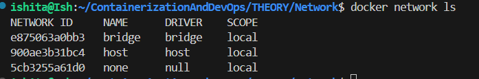
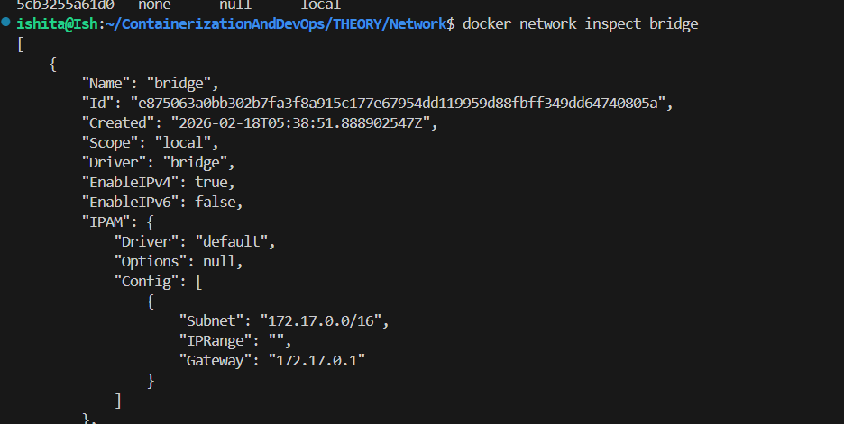
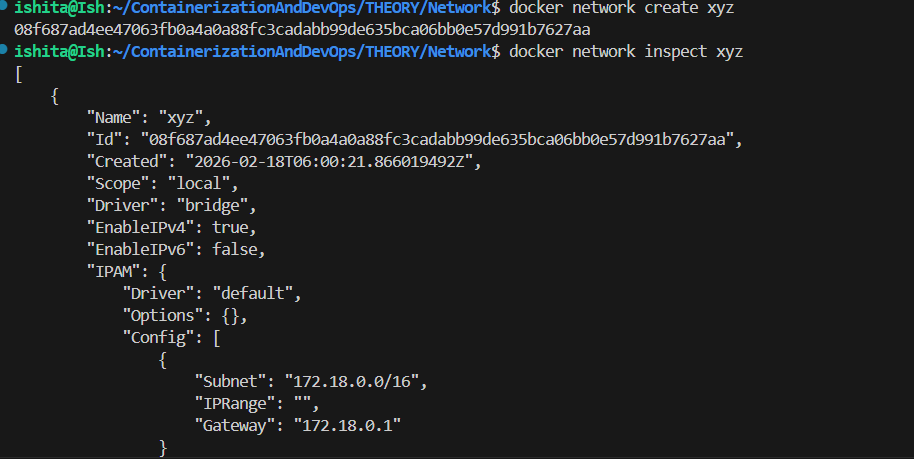
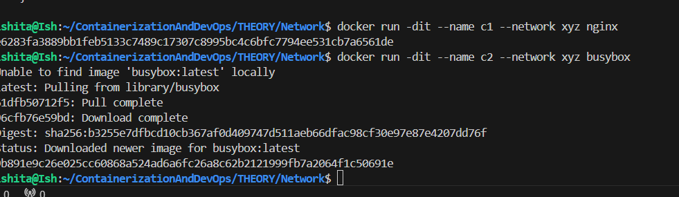
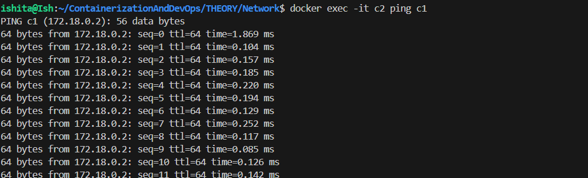
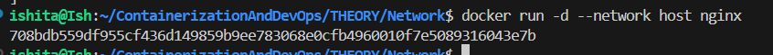
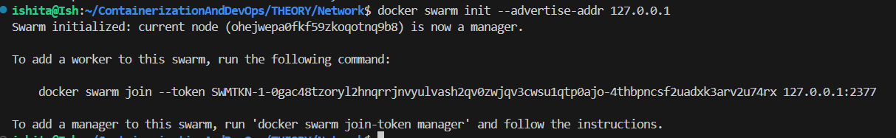
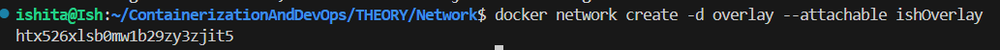

## Network

1. Inspecting bridge 

- using command `docker network ls` shows existing networks

- 3 networks are shown below 2 of which are by default present 

- command - `docker network inspect bridge`

2. Creating custom bridge using command `docker network create xyz` to create network named *xyz*
and on inspecting

here the subnet is different, here 172.18......

3. Running containers in same container
 - *dit* - daemon mode and interactive 
- commands - `docker run -dit --name c1 --network xyz nginx` and `docker run -dit --name c2 --network xyz busybox`
- This connects two networks
- busybox is like lightweight primitive linux

- testing DNS using command `docker exec -it c2 ping c1`
- It means in interactive mode run in container c2 - ping c1 using name only without port and IP

- ping will respond same with IP as the name

4. Host Network 
- Container IP and host machine IP is same

- command `docker run -d --network host nginx` 
nginx is linked to host machine, therefore port of nginx (port 80)

5. to show port mappings `docker port nameOfContainer`

6. Overlays (multiple hosts on same or different network )
- Single host-docker engine, Multiple- Swarm
- Need to allow TCP port on all end decvices:
- 2377/tcp : Swarm Management
- 7946/tcp/udp: NOde communication
- 4789/udp: Overlay Network Traffic

- College Wifi will block these ports so in class I studied communicating with multiple containers on the same device

- Step 1: Initialize Swarm
- We advertise swarm service on docker assigned fixed ip (on our machine)
- Advertised localhost using `docker swarm init --advertise-addr 127.0.0.1`

- token is --token SWMTKN-1-0gac48tzoryl2hnqrrjnvyulvash2qv0zwjqv3cwsu1qtp0ajo-4thbpncsf2uadxk3arv2u74rx 127.0.0.1:2377

- if we need a device connecting to us so the command will be running on the device but the IP used will be of the docker initial host(dedicated ip)

- Step 2:
- Creating overlay network on swarm network

command - `docker network create -d overlay --attachable ishOverlay` 
- -d means driver (n/w driver used)

- Step3 : we will make two containers and later ping (here same machine)

7. MACVLAN and IPVLAN

- 
