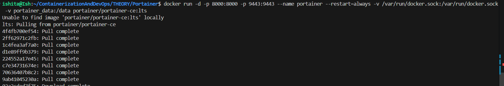
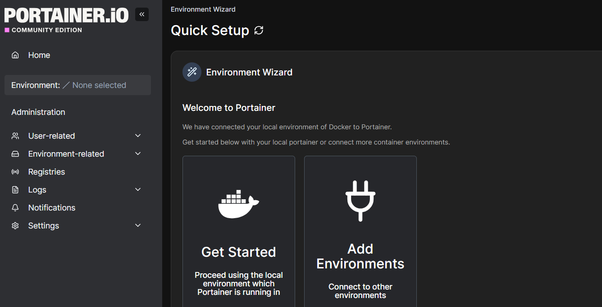
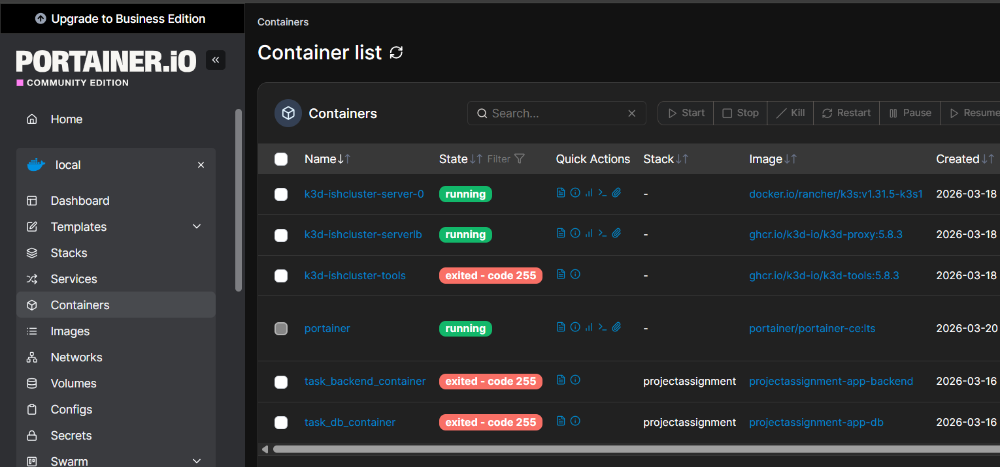

## Portainer

1. Installation

- Create a volume that Portainer Server will use to store its database

`docker volume create portainer_data`


- download and install the Portainer Server container
```docker
docker run -d -p 8000:8000 -p 9443:9443 --name portainer --restart=always -v /var/run/docker.sock:/var/run/docker.sock -v portainer_data:/data portainer/portainer-ce:lts
```

- Log in via https://localhost:9443



- ishita12345

2. All the things we were able to do via CLI here we are able to use via web interface

3. Use case : Manage and observe remotely

4. Every container here is able to have admin access as we have directly mapped doker sock, therfore all containers running are aware of what is happening on the host

5. Portainer is communicating via API

- Portainer is enhancing view of pre-exitsting services and providing functionalites in addition

## Komodo


