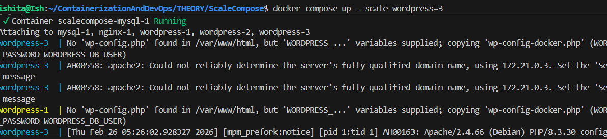
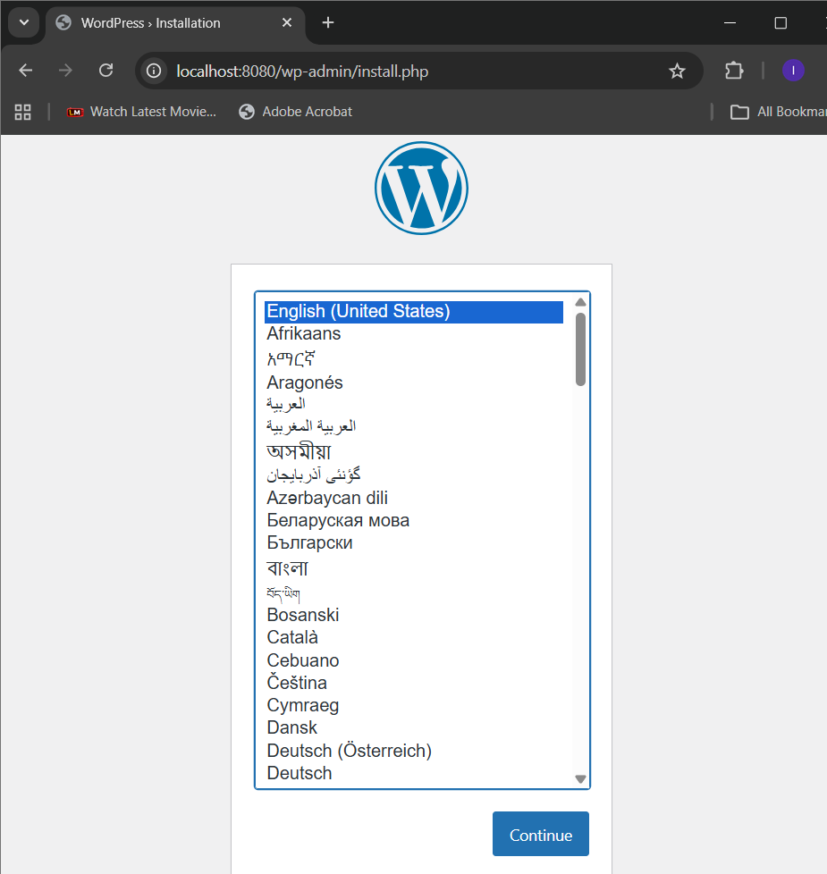
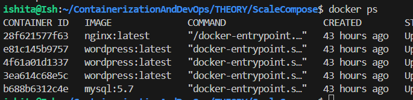

# Scaling with Docker compose
1. Using the Expose 
Expose "3000" preferable for scaling (docker can access container via dns (container name+port))
- in such case in every container service is running on this 3000 port 
- using docker discovery all ports can be easily discovered

- LOAD BALANCE can tehrefore be externally done and can be done via docker

- New change- in yaml file remove port and do expose 80 and add a new service nginx 
- nginx can be a load balancer and request proxy to handle requests
- define a config - nginx file and service will start after wordpress
uses the same nw as initial one

2. Veryifying using the command `docker ps`

