## Volume, Bindmount and Tempfs + ASSIGNMENT

1. Create a volume, here I named it ***ishvol***
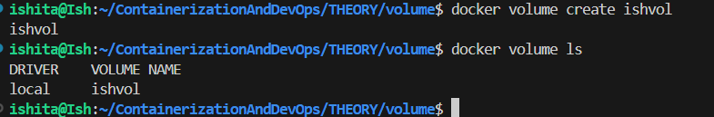

2. Using volume 
- -it as we want to modify and test
- forcefully specified that we entered bin/bash
- name is ishvol and -v ishvol is the volume created and mapped to location `home/ishita/ContainerizationAndDevOps/Theory/ClassTest/app`
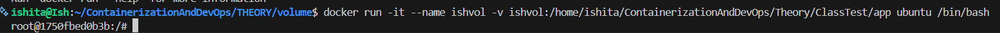

3. 
- Since ishvol is just a name (not a path starting with / or ./), Docker creates a managed volume.

The Result: When I created sapid.txt inside the container, Docker saved it into that managed volume

4. Persistence:deleting the container using `docker rm 1750` gets that container starting with id 1750 deleted 
- On starting a new container (ishvol2) using the same volume, Because the volume is independent of the container, the file sapid.txt was still there
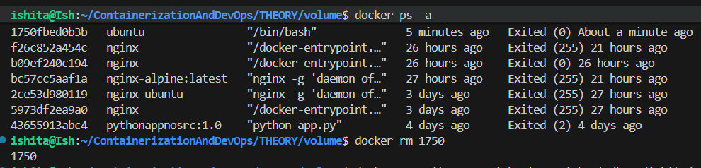
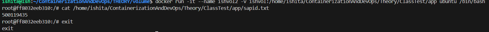

5. In the command `docker run -it --name ishvol3 ubuntu /bin/bash` -v is missing
- This container has its own fresh file system
-  It has no connection to the ishvol volume or the host's files
- On trying to cd into that long path, it failed because that directory structure only existed inside the previous containers because the -v flag created it.

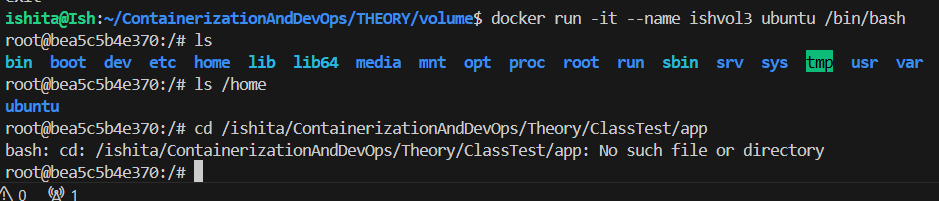

6. On using the command `docker run -it --rm -v ./ishvol:/home/ishita/.../app ubuntu /bin/bash`
- the folder ishvol in my current directory is taken on my laptop and got linked to the container
- On typing echo 500119xyz > sapid.txt inside the container, the file appeared immediately on host machine
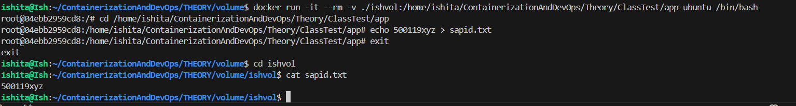

7. Key Differences

| Feature | Volume | Bindmount |
| :--- | :--- | :--- |
| Location | Managed by Docker (hidden) | On the host (vizible) |
| Ease of Use | Dockers handles everything | Manual intervention like path specification |
| Use Case | Database storage, internal app data | Sharing code/config between host and container |

## Mount
- -v shorthand problem was consistency/redundancy issue
- mount may require more typing but it is much more clearer as it has parameters like type= ...(volume), source=...(folder/file) 
- if in type we give tempfs we can remove the soure type as docker is creating location in memory
- type = bind case give path (relative/absolute)
- we can use -v for testing but mount is preferred
- tempfs for sensitive data

1. 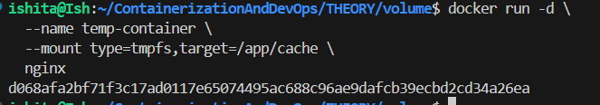

### Assignment
1.  Creation and Backup
- Firstly a fresh volume named *source_vol* was created
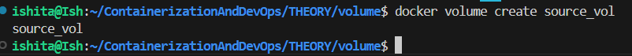

- using the command `docker run --rm -v source_vol:/data ubuntu bash -c "echo 'Backup Test Data 2026' > /data/file1.txt"`, data was added using a temporary container
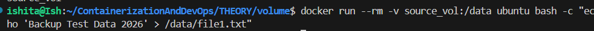

- Performing backup using command `docker run --rm -v source_vol:/volume -v $(pwd):/backup ubuntu tar cvf /backup/my_backup.tar /volume`

- *-v source_vol:/volume* mounts the source volume so container can read it 

- *-v $(pwd):/backup* mounts current host folder so backup file can be written here
- *tar cvf /backup/my_backup.tar /volume* for creating a compressed archive of columes contents. 

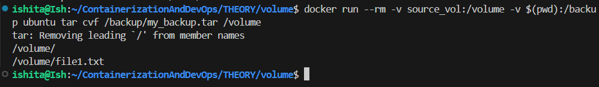
 
- And in the below picture *my_backup.tar* is in the local directory 
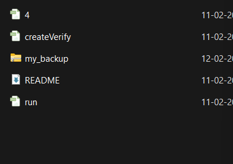

2. Shift/Restoring to a new volume *dest_vol*
- Creating a destination volume for the shift using `docker volume create dest_vol`

- Using `docker run --rm -v dest_vol:/volume -v $(pwd):/backup ubuntu bash -c "tar xvf /backup/my_backup.tar -C / --strip-components=1"` for restoring the data 
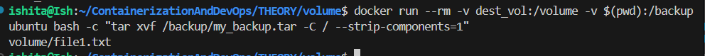

- Verifying using `docker run --rm -v dest_vol:/check ubuntu ls /check
docker run --rm -v dest_vol:/check ubuntu cat /check/file1.txt`
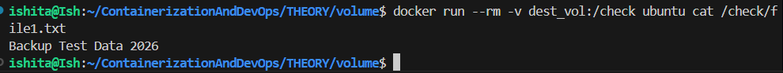

## Observations
| Operation | Concept | Logic |
| :--- | :--- | :--- |
| Backup | Volume to Host | Mount volume and host folder; tar the volume into the host folder |
| Restore | Host to Volume | Mount host folder and new volume; untar the file into the volume |
| Shifting | Source volume to Destination volume | Backup Volume (source) to a file, then Restore that file into Volume (hhere destination)  |

